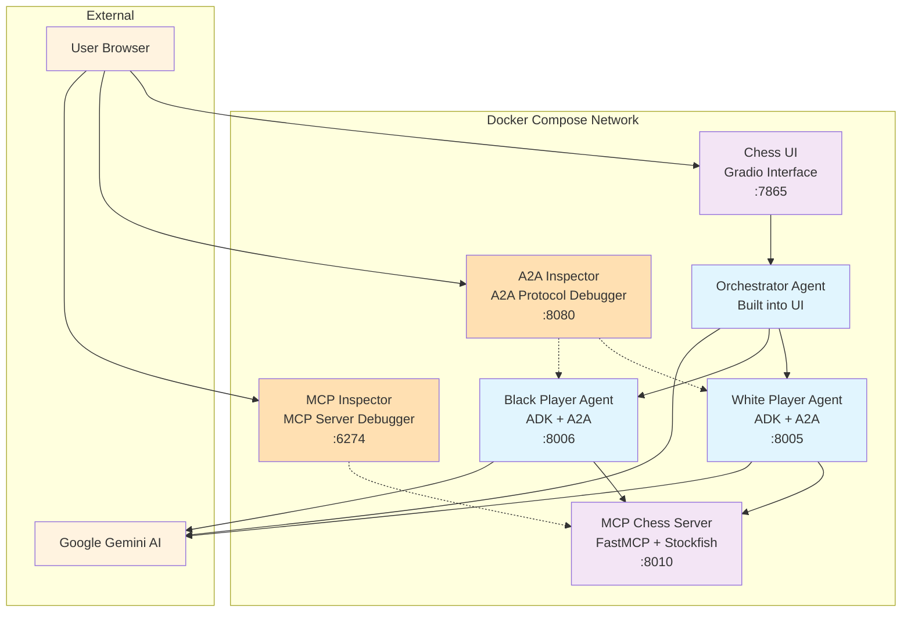

# Chess Multi-Agent System with MCP & A2A Protocol

A containerized chess system demonstrating Google's Agent Development Kit (ADK) with Agent-to-Agent (A2A) protocol communication and Model Context Protocol (MCP) integration.

## 🏗️ Architecture Overview



## 📁 Project Structure

```
.
├── README.md                          # This file
├── docker-compose.yml                 # Multi-service orchestration
├── adk_chess/                          # ADK Chess Application
│   ├── .env                           # Environment configuration (create from template)
│   ├── .env.template                  # Environment template with placeholder values
│   ├── Dockerfile                     # Chess UI container
│   ├── pyproject.toml                 # Python dependencies
│   ├── uv.lock                        # Dependency lockfile
│   ├── simple_chess_ui.py             # Gradio web interface
│   ├── chess_game_manager.py          # Chess game state management
│   ├── orchestrator_agent/
│   │   └── agent.py                   # Main orchestrator with A2A communication
│   ├── white_player_agent/
│   │   ├── Dockerfile                 # White player container
│   │   └── agent.py                   # White player ADK agent (auto-generates A2A card)
│   └── black_player_agent/
│       ├── Dockerfile                 # Black player container
│       └── agent.py                   # Black player ADK agent (auto-generates A2A card)
└── chess-mcp-server/                  # MCP Chess Server
    ├── Dockerfile                     # MCP server container
    ├── pyproject.toml                 # FastMCP dependencies
    ├── uv.lock                        # Dependency lockfile
    └── chess_mcp_server.py            # FastMCP server with Stockfish
```

## 🧩 Component Details

### 1. **MCP Chess Server** (`chess-mcp-server/`)
- **Technology**: FastMCP 2.0 + Stockfish chess engine
- **Purpose**: Provides chess game logic, move validation, and AI move generation
- **Port**: 8010
- **Endpoints**: 
  - `/mcp` - MCP protocol communication
  - `/health` - Health check endpoint

### 2. **White Player Agent** (`adk_chess/white_player_agent/`)
- **Technology**: Google ADK + A2A protocol
- **Purpose**: AI agent that generates moves for white pieces
- **Port**: 8005
- **Features**:
  - A2A protocol communication via `to_a2a()` utility
  - Dynamic agent card generation at `/.well-known/agent-card.json`
  - MCP client for chess operations
  - Gemini AI integration for move generation

### 3. **Black Player Agent** (`adk_chess/black_player_agent/`)
- **Technology**: Google ADK + A2A protocol  
- **Purpose**: AI agent that generates moves for black pieces
- **Port**: 8006
- **Features**: Identical to white player but for black pieces

### 4. **Chess UI & Orchestrator** (`adk_chess/`)
- **Technology**: Gradio + ADK Orchestrator Agent
- **Purpose**: Web interface and game orchestration
- **Port**: 7865
- **Features**:
  - Interactive web UI for viewing games
  - Orchestrator agent manages complete automated games
  - A2A communication with player agents via `RemoteA2aAgent` + `AgentTool`

### 5. **A2A Inspector** (Debugging Tool)
- **Technology**: Web-based A2A protocol debugger
- **Purpose**: Debug and inspect A2A agent communication
- **Port**: 8080
- **Features**:
  - Real-time A2A protocol monitoring
  - Agent discovery and capability inspection
  - Interactive agent testing and debugging
  - Connect to agents at `http://white-player-agent:8005` and `http://black-player-agent:8006`

### 6. **MCP Inspector** (Debugging Tool)
- **Technology**: Model Context Protocol debugger
- **Purpose**: Debug and test MCP server interactions
- **Port**: 6274
- **Features**:
  - Interactive MCP server testing
  - Tool discovery and execution
  - Real-time protocol monitoring
  - Connect to chess MCP server at `http://chess-mcp-server:5000/mcp` with `streamable-http` transport

## 🚀 Getting Started

### Prerequisites
- Docker and Docker Compose
- Google AI Studio API key (for Gemini integration)
- *(Optional)* AgentOps account and API key (for observability) - [Get started at app.agentops.ai](https://app.agentops.ai/settings/projects)

### Setup Instructions

1. **Clone and Navigate**
   ```bash
   git clone <repository-url>
   cd chc-python-meetup-mcp-a2a-talk
   ```

2. **Configure Environment**
   ```bash
   # Copy the template and add your API keys
   cp adk_chess/.env.template adk_chess/.env
   
   # Edit adk_chess/.env and add your actual keys
   GOOGLE_API_KEY=your_google_api_key_here
   AGENTOPS_API_KEY=your_agentops_api_key_here
   
   # Optional: Disable observability if not needed
   AGENTOPS_USE=false
   ```

3. **Build and Run**
   ```bash
   # Build and start all services
   docker compose up --build
   
   # Or run in detached mode
   docker compose up --build -d
   ```

4. **Access the Application**
   - Open browser to: http://localhost:7865
   - Click "Start Automated Game" to begin
   - Watch AI agents play chess automatically!

### Service URLs
- **Chess UI**: http://localhost:7865
- **White Player Agent Card**: http://localhost:8005/.well-known/agent-card.json  
- **Black Player Agent Card**: http://localhost:8006/.well-known/agent-card.json
- **MCP Server Health**: http://localhost:8010/health
- **A2A Inspector**: http://localhost:8080 (debug A2A protocol communication)
- **MCP Inspector**: http://localhost:6274 (debug MCP server interactions)
- **AgentOps Dashboard**: https://app.agentops.ai (view agent traces and performance metrics)

## 🔧 Development

### Individual Service Testing

Test individual containers before full compose:

```bash
# Test MCP Server
cd chess-mcp-server
docker build -t chess-mcp-server .
docker run -p 8010:5000 chess-mcp-server

# Test Player Agents
cd adk_chess
docker build -f white_player_agent/Dockerfile -t white-player-agent .
docker run -p 8005:8005 --env-file .env white-player-agent

# Test Chess UI
docker build -f Dockerfile -t chess-ui .
docker run -p 7865:7865 \
  -e WHITE_PLAYER_URL=http://host.docker.internal:8005 \
  -e BLACK_PLAYER_URL=http://host.docker.internal:8006 \
  -e MCP_SERVER_URL=http://host.docker.internal:8010/mcp \
  --env-file .env \
  chess-ui
```

### Service Dependencies

Services start in this order:
1. **MCP Server** (foundation service)
2. **Player Agents** (depend on MCP server health)
3. **Chess UI** (depends on both player agents)

Health checks ensure proper startup sequencing.

## 🏛️ Technical Architecture

### A2A Protocol Communication
- Player agents expose A2A endpoints via `to_a2a(root_agent, port=8005, host=...)` utility
- Agent cards are **dynamically generated** from ADK agent configuration (no static JSON files)
- Orchestrator uses `RemoteA2aAgent` + `AgentTool` for communication
- Agents advertise capabilities via auto-generated `/.well-known/agent-card.json` endpoints

### MCP Integration  
- Player agents connect to MCP server for chess operations
- MCP server provides Stockfish engine integration
- Supports move validation, game status, and AI move generation

### Environment Configuration
- `env_file`: Base configuration from `.env`
- `environment`: Docker Compose service-specific overrides
- Precedence: Docker environment > env_file > Dockerfile

## 📊 Agent Observability with AgentOps

This system includes optional comprehensive observability through AgentOps integration.

### Enabling/Disabling AgentOps
Control observability via the `AGENTOPS_USE` environment variable:
```bash
# Enable observability (default)
AGENTOPS_USE=true

# Disable observability for production or privacy
AGENTOPS_USE=false
```

When enabled, you'll see startup messages: `🔍 AgentOps observability enabled for [agent-type] agent`

### What AgentOps Captures
- **Agent Execution Traces**: Hierarchical view of agent interactions and workflows
- **LLM Interactions**: Token usage, response times, and model performance metrics
- **Tool Usage**: Chess MCP operations, move validation, and game state changes
- **A2A Communication**: Inter-agent messaging and coordination patterns
- **Session Replays**: Complete game sessions with agent decision-making processes

### Viewing Agent Performance
1. Run a chess game through the UI
2. Visit [AgentOps Dashboard](https://app.agentops.ai)
3. View session traces tagged by agent type:
   - `chess`, `orchestrator` - Game coordination and management
   - `chess`, `white-player` - White piece move generation
   - `chess`, `black-player` - Black piece move generation

### Key Metrics Available
- **Response Times**: Agent processing and A2A communication latency
- **Token Usage**: Gemini API consumption per agent and game
- **Success Rates**: Move validation and game completion statistics
- **Error Tracking**: Failed moves, communication errors, and recovery patterns

## 🐛 Troubleshooting

### Common Issues

**Service Health Checks Failing**
```bash
# Check individual service health
docker exec <container-name> curl -f http://localhost:<port>/health
```

**A2A Communication Errors**
```bash
# Verify agent cards are accessible (dynamically generated)
curl http://localhost:8005/.well-known/agent-card.json
curl http://localhost:8006/.well-known/agent-card.json
```

**Environment Variables Not Loading**
```bash
# Check container environment
docker exec <container-name> env | grep -E "(PLAYER|GOOGLE|MCP)"
```

### Logs
```bash
# View all service logs
docker compose logs

# Follow specific service
docker compose logs -f chess-ui

# View recent logs
docker compose logs --tail=50
```

## 🎯 Features Demonstrated

- **Multi-Agent Architecture**: Orchestrator coordinating specialized agents
- **A2A Protocol**: Standardized agent-to-agent communication  
- **MCP Integration**: Model Context Protocol for external services
- **Container Orchestration**: Docker Compose with health checks and dependencies
- **AI Integration**: Google Gemini for move generation
- **Real-time Updates**: Live game progression via Gradio interface
- **Dynamic Agent Cards**: Auto-generated A2A metadata from agent configuration
- **Agent Observability**: AgentOps integration for session replays, metrics, and performance monitoring
- **Protocol Debugging**: A2A Inspector for agent communication debugging
- **MCP Server Testing**: MCP Inspector for interactive server testing and tool discovery

## 📚 Technologies Used

- **Google ADK**: Agent Development Kit for AI agent creation
- **A2A Protocol**: Agent-to-Agent communication standard
- **MCP**: Model Context Protocol for external service integration
- **FastMCP**: High-performance MCP server framework
- **AgentOps**: Agent observability platform for session replays and performance monitoring
- **Gradio**: Web interface for ML applications
- **Stockfish**: Open-source chess engine
- **Docker Compose**: Multi-container orchestration
- **Google Gemini**: Large language model for AI decision-making

---

*This project demonstrates production-ready patterns for multi-agent systems with proper containerization, health monitoring, and inter-service communication.*