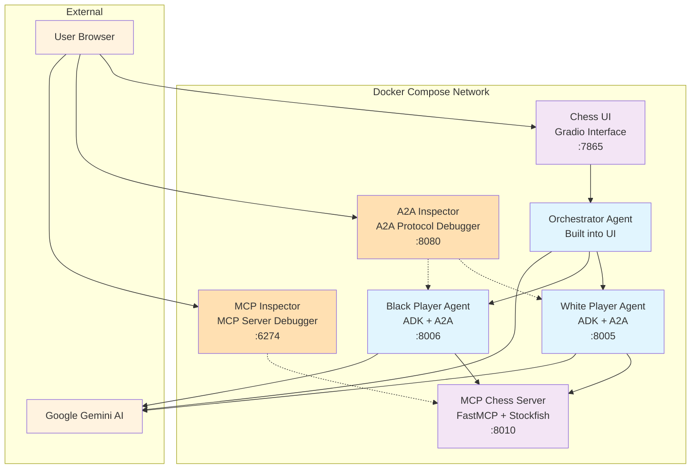

# Chess Multi-Agent System with MCP & A2A Protocol

A containerized chess system demonstrating Google's Agent Development Kit (ADK) with Agent-to-Agent (A2A) protocol communication and Model Context Protocol (MCP) integration.

## 🖥️ Gradio GUI Frontend


## 🏗️ Architecture Overview



## 📁 Project Structure

```
.
├── README.md                          # This file
├── docker-compose.yml                 # Multi-service orchestration
├── adk_chess/                          # ADK Chess Application
│   ├── .env                           # Environment configuration (create from template)
│   ├── .env.template                  # Environment template with placeholder values
│   ├── Dockerfile                     # Chess UI container
│   ├── pyproject.toml                 # Python dependencies
│   ├── uv.lock                        # Dependency lockfile
│   ├── simple_chess_ui.py             # Gradio web interface
│   ├── chess_game_manager.py          # Chess game state management
│   ├── orchestrator_agent/
│   │   └── agent.py                   # Main orchestrator with A2A communication
│   ├── white_player_agent/
│   │   ├── Dockerfile                 # White player container
│   │   └── agent.py                   # White player ADK agent (auto-generates A2A card)
│   └── black_player_agent/
│       ├── Dockerfile                 # Black player container
│       └── agent.py                   # Black player ADK agent (auto-generates A2A card)
└── chess-mcp-server/                  # MCP Chess Server
    ├── Dockerfile                     # MCP server container
    ├── pyproject.toml                 # FastMCP dependencies
    ├── uv.lock                        # Dependency lockfile
    └── chess_mcp_server.py            # FastMCP server with Stockfish
```

## 🧩 Component Details

### 1. **MCP Chess Server** (`chess-mcp-server/`)
- **Technology**: FastMCP 2.0 + Stockfish chess engine
- **Purpose**: Provides chess game logic, move validation, and AI move generation
- **Port**: 8010
- **Endpoints**: 
  - `/mcp` - MCP protocol communication
  - `/health` - Health check endpoint

### 2. **White Player Agent** (`adk_chess/white_player_agent/`)
- **Technology**: Google ADK + A2A protocol
- **Purpose**: AI agent that generates moves for white pieces
- **Port**: 8005
- **Features**:
  - A2A protocol communication via `to_a2a()` utility
  - Dynamic agent card generation at `/.well-known/agent-card.json`
  - MCP client for chess operations
  - Gemini AI integration for move generation

### 3. **Black Player Agent** (`adk_chess/black_player_agent/`)
- **Technology**: Google ADK + A2A protocol  
- **Purpose**: AI agent that generates moves for black pieces
- **Port**: 8006
- **Features**: Identical to white player but for black pieces

### 4. **Chess UI & Orchestrator** (`adk_chess/`)
- **Technology**: Gradio + ADK Orchestrator Agent
- **Purpose**: Web interface and game orchestration
- **Port**: 7865
- **Features**:
  - Interactive web UI for viewing games
  - Orchestrator agent manages complete automated games
  - A2A communication with player agents via `RemoteA2aAgent` + `AgentTool`

### 5. **A2A Inspector** (Debugging Tool)
- **Technology**: Web-based A2A protocol debugger
- **Purpose**: Debug and inspect A2A agent communication
- **Port**: 8080
- **Features**:
  - Real-time A2A protocol monitoring
  - Agent discovery and capability inspection
  - Interactive agent testing and debugging
  - Connect to agents at `http://white-player-agent:8005` and `http://black-player-agent:8006`

### 6. **MCP Inspector** (Debugging Tool)
- **Technology**: Model Context Protocol debugger
- **Purpose**: Debug and test MCP server interactions
- **Port**: 6274
- **Features**:
  - Interactive MCP server testing
  - Tool discovery and execution
  - Real-time protocol monitoring
  - Connect to chess MCP server at `http://chess-mcp-server:5000/mcp` with `streamable-http` transport

## 🚀 Getting Started

### Prerequisites
- Docker and Docker Compose
- Google AI Studio API key (for Gemini integration)
- *(Optional)* AgentOps account and API key (for observability) - [Get started at app.agentops.ai](https://app.agentops.ai/settings/projects)

### Setup Instructions

1. **Clone and Navigate**
   ```bash
   git clone <repository-url>
   cd chc-python-meetup-mcp-a2a-talk
   ```

2. **Configure Environment**
   ```bash
   # Copy the template and add your API keys
   cp adk_chess/.env.template adk_chess/.env
   
   # Edit adk_chess/.env and add your actual keys
   GOOGLE_API_KEY=your_google_api_key_here
   AGENTOPS_API_KEY=your_agentops_api_key_here
   
   # Optional: Disable observability if not needed
   AGENTOPS_USE=false
   ```

3. **Build and Run**
   ```bash
   # Build and start all services
   docker compose up --build
   
   # Or run in detached mode
   docker compose up --build -d
   ```

4. **Access the Application**
   - Open browser to: http://localhost:7865
   - Click "Start Automated Game" to begin
   - Watch AI agents play chess automatically!

### Service URLs
- **Chess UI**: http://localhost:7865
- **White Player Agent Card**: http://localhost:8005/.well-known/agent-card.json  
- **Black Player Agent Card**: http://localhost:8006/.well-known/agent-card.json
- **MCP Server Health**: http://localhost:8010/health
- **A2A Inspector**: http://localhost:8080 (debug A2A protocol communication)
- **MCP Inspector**: http://localhost:6274 (debug MCP server interactions)
- **AgentOps Dashboard**: https://app.agentops.ai (view agent traces and performance metrics)

## 🔧 Development

### Testing Player Agents with curl

You can test the A2A player agents directly using curl. Send chess positions in FEN format to get move responses:

**Test White Player Agent:**
```bash
curl -s -X POST http://localhost:8005/ \
     -H "Content-Type: application/json" \
     -d '{
           "jsonrpc": "2.0",
           "method": "message/send",
           "id": 1,
           "params": {
             "message": {
               "messageId": "msg-001",
               "role": "user",
               "parts": [
                 {
                   "text": "rnbqkbnr/pppppppp/8/8/8/8/PPPPPPPP/RNBQKBNR w KQkq - 0 1"
                 }
               ]
             }
           }
         }' | jq '.'
```

**Test Black Player Agent:**
```bash
curl -s -X POST http://localhost:8006/ \
     -H "Content-Type: application/json" \
     -d '{
           "jsonrpc": "2.0",
           "method": "message/send",
           "id": 1,
           "params": {
             "message": {
               "messageId": "msg-001", 
               "role": "user",
               "parts": [
                 {
                   "text": "rnbqkbnr/pppppppp/8/8/4P3/8/PPPP1PPP/RNBQKBNR b KQkq e3 0 1"
                 }
               ]
             }
           }
         }' | jq '.'
```

**Extract Just the Move:**
```bash
# Add this filter to get clean move output
| jq -r '.result.history[] | select(.role == "agent") | .parts[] | select(.kind == "text" and (.metadata.adk_thought | not)) | .text' | tail -1
```

*Note: The orchestrator agent cannot be tested directly as it requires a browser session through the Gradio interface.*

### ADK Development UI

Use the `adk web` CLI for interactive agent testing with a web interface:

```bash
# Navigate to the agent directory
cd adk_chess

# Launch the development UI
uv run adk web

# Access at: http://127.0.0.1:8000
```

The ADK web UI provides:
- **Interactive chat interface** with player agents
- **Real-time tool execution** visibility (MCP calls)
- **Session management** and conversation history
- **Multi-agent selection** from dropdown
- **Visual debugging** interface

Select player agents (white_player_agent, black_player_agent) from the dropdown and test with FEN positions interactively.

*Note: The orchestrator agent cannot be tested via ADK web as it relies on shared global state (ChessGameManager) with the Gradio interface and connects to remote A2A player agents configured for Docker networking.*

**Example interaction with white player agent:**
```
Input: rnbqkbnr/pppppppp/8/8/8/8/PPPPPPPP/RNBQKBNR w KQkq - 0 1

Thought
My Strategy for Generating the Best White Move

Okay, here's the game plan. The user has given me a FEN string, and my task is to produce the optimal white move. Being the seasoned professional that I am, I'll approach this methodically. First, I need to ensure the FEN string is legitimate; I'll use validate_fen for that crucial step. Assuming that passes muster, I'll then leverage get_stockfish_move to tap into the engine's power and determine the best possible move. However, I won't blindly trust that result! I'll immediately validate the move itself using validate_move, ensuring it's a legal and sensible action. Finally, and only after all these checks and balances are in place, will I structure the result in the expected JSON format using set_model_response, providing a clean, validated, and optimized response for the user. This ensures I deliver a high-quality move, backed by solid verification and ready for integration.

Thought
My Analytical Process for the Chess Position

Okay, the FEN string is looking good – it's definitely a valid representation of the chess position. Now, the real work begins. My next step, as always in these analyses, is to leverage the power of get_stockfish_move. I need Stockfish's expert evaluation to pinpoint the objectively best move for White in this specific scenario. I'm relying on Stockfish's deep analysis and the wealth of data it's able to process to guide my strategic thinking. This initial step will give me the crucial foundation for my own, more nuanced, understanding of the position.

My Next Step: Validating the Stockfish Move

Stockfish has delivered its recommendation: "e2e4". While I trust Stockfish's judgment implicitly, my internal process demands a final verification. To ensure absolute accuracy and adherence to chess rules, my immediate next step is to use the validate_move tool. I will provide the original FEN and Stockfish's suggested move ("e2e4") to validate_move. This crucial step confirms that the move is indeed legal within the given board state, guaranteeing that the final output is not only optimal but also perfectly permissible under the laws of chess. This methodical approach is key to delivering a consistently reliable and error-free response.

Thought
My Strategic Evaluation of Stockfish's Move

Okay, so Stockfish is suggesting "e2e4." That's a classic opening, but before I automatically endorse it, I need to rigorously vet it. My immediate thought is to use validate_move to confirm its legality within the current board state. I can't just blindly accept the engine's suggestion, even though Stockfish is incredibly strong. The potential consequences of an illegal move are too great, it could crash the program, or lead to an incorrect analysis. This validation step is fundamental to ensuring the integrity of the analysis and ensuring that I am working with a reliable starting point. After validate_move confirms its legality, only then can I confidently integrate this move into my model response.

Finalizing the Response with a Validated Move

The final validation step is complete, and "e2e4" has been confirmed as a perfectly legal move for the given FEN. All the checks are in place. My internal process has verified the FEN, retrieved an optimal move from Stockfish, and rigorously validated that move. I can now confidently and definitively set the model's response. The set_model_response tool is the final action, delivering the validated move in the required JSON format. This structured output is critical for downstream systems, and this step ensures that the entire analytical pipeline, from initial FEN validation to final move confirmation, has been executed flawlessly.

Thought
Validating and Responding to the Move

Okay, "e2e4" is confirmed. That's good, it's a solid opening. Now that I have the validated move, I need to integrate it into my response. I'll set the model output to reflect this move, ensuring it's clearly communicated. This is the stage where I transition from the analysis of potential moves to actually playing the first move in the game, in this instance "e2e4".

{"move": "e2e4"}
```

The agent shows its complete thinking process including strategic planning, FEN validation, Stockfish consultation, move validation, and structured JSON response generation.

### MCP Inspector Usage

Use the MCP Inspector to test and debug MCP server interactions:

1. **Access MCP Inspector**: http://localhost:6274
2. **Configure Connection**:
   - **Transport Type**: `Streamable HTTP`
   - **URL**: `http://chess-mcp-server:5000/mcp`
3. **Test Tools**:
   - Navigate to **Tools Tab**
   - Click **List Tools** to discover available tools
   - Select **get_stockfish_move** tool
   - Enter parameter: `fen` = `rnbqkbnr/pppppppp/8/8/8/8/PPPPPPPP/RNBQKBNR w KQkq - 0 1`
   - Click **Run Tool** button to see resulting output

**Example MCP Result JSON:**
```json
{
  "success": true,
  "move_uci": "e2e4",
  "error": null
}
```

The MCP Inspector provides direct access to chess engine functionality and real-time protocol monitoring.

### A2A Inspector Usage

Use the A2A Inspector to test and debug A2A agent communication:

1. **Access A2A Inspector**: http://localhost:8080
2. **Connect to Agent**:
   - Enter agent URL in top box: `http://white-player-agent:8005`
   - Click **Connect**
   - View the dynamically generated **Agent Card**
3. **Test Agent Communication**:
   - Enter FEN in message box: `rnbqkbnr/pppppppp/8/8/8/8/PPPPPPPP/RNBQKBNR w KQkq - 0 1`
   - Click **Send**
   - Wait for processing
   - Click the **task Task created with status: completed ✅** message to see resulting JSON

**Example A2A Response:**
```json
{
  "artifacts": [
    {
      "artifactId": "11b740b2-c3a5-488c-8827-1c4f77f858e7",
      "parts": [
        {
          "kind": "text",
          "text": "{\"move\": \"e2e4\"}"
        }
      ]
    }
  ],
  "contextId": "0b3040f8-6f08-48b0-8a09-2fe5199a2aa1",
  "history": [
    {
      "contextId": "0b3040f8-6f08-48b0-8a09-2fe5199a2aa1",
      "kind": "message",
      "messageId": "msg-1756179429989-mcozpu6ym",
      "metadata": {},
      "parts": [
        {
          "kind": "text",
          "text": "rnbqkbnr/pppppppp/8/8/8/8/PPPPPPPP/RNBQKBNR w KQkq - 0 1"
        }
      ],
      "role": "user",
      "taskId": "cf0184a9-db75-4e97-841f-e2aeb4b4078a"
    },
    
    ...
    
    {
      "kind": "message",
      "messageId": "282939c1-0977-4fd4-b16f-92fe9b7342ed",
      "parts": [
        {
          "kind": "text",
          "text": "{\"move\": \"e2e4\"}"
        }
      ],
      "role": "agent"
    }
  ],
  "id": "cf0184a9-db75-4e97-841f-e2aeb4b4078a",
  "kind": "task",
  "metadata": {
    "adk_app_name": "white_chess_player_agent",
    "adk_user_id": "A2A_USER_0b3040f8-6f08-48b0-8a09-2fe5199a2aa1",
    "adk_session_id": "0b3040f8-6f08-48b0-8a09-2fe5199a2aa1",
    "adk_invocation_id": "",
    "adk_author": "white_chess_player_agent",
    "adk_usage_metadata": {
      "candidatesTokenCount": 151,
      "promptTokenCount": 1588,
      "promptTokensDetails": [
        {
          "modality": "TEXT",
          "tokenCount": 1588
        }
      ],
      "thoughtsTokenCount": 25,
      "totalTokenCount": 1764
    }
  },
  "status": {
    "state": "completed",
    "timestamp": "2025-08-26T03:37:25.860102+00:00"
  },
  "validation_errors": []
}
```

The A2A Inspector shows the complete task execution including agent thinking process, tool usage, and final JSON response.

### Individual Service Testing

Test individual containers before full compose:

```bash
# Test MCP Server
cd chess-mcp-server
docker build -t chess-mcp-server .
docker run -p 8010:5000 chess-mcp-server

# Test Player Agents
cd adk_chess
docker build -f white_player_agent/Dockerfile -t white-player-agent .
docker run -p 8005:8005 --env-file .env white-player-agent

# Test Chess UI
docker build -f Dockerfile -t chess-ui .
docker run -p 7865:7865 \
  -e WHITE_PLAYER_URL=http://host.docker.internal:8005 \
  -e BLACK_PLAYER_URL=http://host.docker.internal:8006 \
  -e MCP_SERVER_URL=http://host.docker.internal:8010/mcp \
  --env-file .env \
  chess-ui
```

### Service Dependencies

Services start in this order:
1. **MCP Server** (foundation service)
2. **Player Agents** (depend on MCP server health)
3. **Chess UI** (depends on both player agents)

Health checks ensure proper startup sequencing.

## 🏛️ Technical Architecture

### A2A Protocol Communication
- Player agents expose A2A endpoints via `to_a2a(root_agent, port=8005, host=...)` utility
- Agent cards are **dynamically generated** from ADK agent configuration (no static JSON files)
- Orchestrator uses `RemoteA2aAgent` + `AgentTool` for communication
- Agents advertise capabilities via auto-generated `/.well-known/agent-card.json` endpoints

### MCP Integration  
- Player agents connect to MCP server for chess operations
- MCP server provides Stockfish engine integration
- Supports move validation, game status, and AI move generation

### Environment Configuration
- `env_file`: Base configuration from `.env`
- `environment`: Docker Compose service-specific overrides
- Precedence: Docker environment > env_file > Dockerfile

## 📊 Agent Observability with AgentOps

This system includes optional comprehensive observability through AgentOps integration.

### Enabling/Disabling AgentOps
Control observability via the `AGENTOPS_USE` environment variable:
```bash
# Enable observability (default)
AGENTOPS_USE=true

# Disable observability for production or privacy
AGENTOPS_USE=false
```

When enabled, you'll see startup messages: `🔍 AgentOps observability enabled for [agent-type] agent`

### What AgentOps Captures
- **Agent Execution Traces**: Hierarchical view of agent interactions and workflows
- **LLM Interactions**: Token usage, response times, and model performance metrics
- **Tool Usage**: Chess MCP operations, move validation, and game state changes
- **A2A Communication**: Inter-agent messaging and coordination patterns
- **Session Replays**: Complete game sessions with agent decision-making processes

### Viewing Agent Performance
1. Run a chess game through the UI
2. Visit [AgentOps Dashboard](https://app.agentops.ai)
3. View session traces tagged by agent type:
   - `chess`, `orchestrator` - Game coordination and management
   - `chess`, `white-player` - White piece move generation
   - `chess`, `black-player` - Black piece move generation

### Key Metrics Available
- **Response Times**: Agent processing and A2A communication latency
- **Token Usage**: Gemini API consumption per agent and game
- **Success Rates**: Move validation and game completion statistics
- **Error Tracking**: Failed moves, communication errors, and recovery patterns

## 🐛 Troubleshooting

### Common Issues

**Service Health Checks Failing**
```bash
# Check individual service health
docker exec <container-name> curl -f http://localhost:<port>/health
```

**A2A Communication Errors**
```bash
# Verify agent cards are accessible (dynamically generated)
curl http://localhost:8005/.well-known/agent-card.json
curl http://localhost:8006/.well-known/agent-card.json
```

**Environment Variables Not Loading**
```bash
# Check container environment
docker exec <container-name> env | grep -E "(PLAYER|GOOGLE|MCP)"
```

### Logs
```bash
# View all service logs
docker compose logs

# Follow specific service
docker compose logs -f chess-ui

# View recent logs
docker compose logs --tail=50
```

## 🎯 Features Demonstrated

- **Multi-Agent Architecture**: Orchestrator coordinating specialized agents
- **A2A Protocol**: Standardized agent-to-agent communication  
- **MCP Integration**: Model Context Protocol for external services
- **Container Orchestration**: Docker Compose with health checks and dependencies
- **AI Integration**: Google Gemini for move generation
- **Real-time Updates**: Live game progression via Gradio interface
- **Dynamic Agent Cards**: Auto-generated A2A metadata from agent configuration
- **Agent Observability**: AgentOps integration for session replays, metrics, and performance monitoring
- **Protocol Debugging**: A2A Inspector for agent communication debugging
- **MCP Server Testing**: MCP Inspector for interactive server testing and tool discovery

## 📚 Technologies Used

- **Google ADK**: Agent Development Kit for AI agent creation
- **A2A Protocol**: Agent-to-Agent communication standard
- **MCP**: Model Context Protocol for external service integration
- **FastMCP**: High-performance MCP server framework
- **AgentOps**: Agent observability platform for session replays and performance monitoring
- **Gradio**: Web interface for ML applications
- **Stockfish**: Open-source chess engine
- **Docker Compose**: Multi-container orchestration
- **Google Gemini**: Large language model for AI decision-making

---

*This project demonstrates production-ready patterns for multi-agent systems with proper containerization, health monitoring, and inter-service communication.*
