# Multi-Agent Chess Playing Game - Technical Design Document

## 1. Executive Summary

This document outlines the technical architecture for a multi-agent chess playing system that leverages the Agent-to-Agent (A2A) protocol for inter-agent communication, Model Context Protocol (MCP) for chess engine integration, and modern web technologies for the user interface. The system consists of five main components: an orchestrator agent, two player agents (white and black), an MCP server with Stockfish integration, and a Gradio web application.

## 2. System Architecture Overview

### 2.1 High-Level Architecture

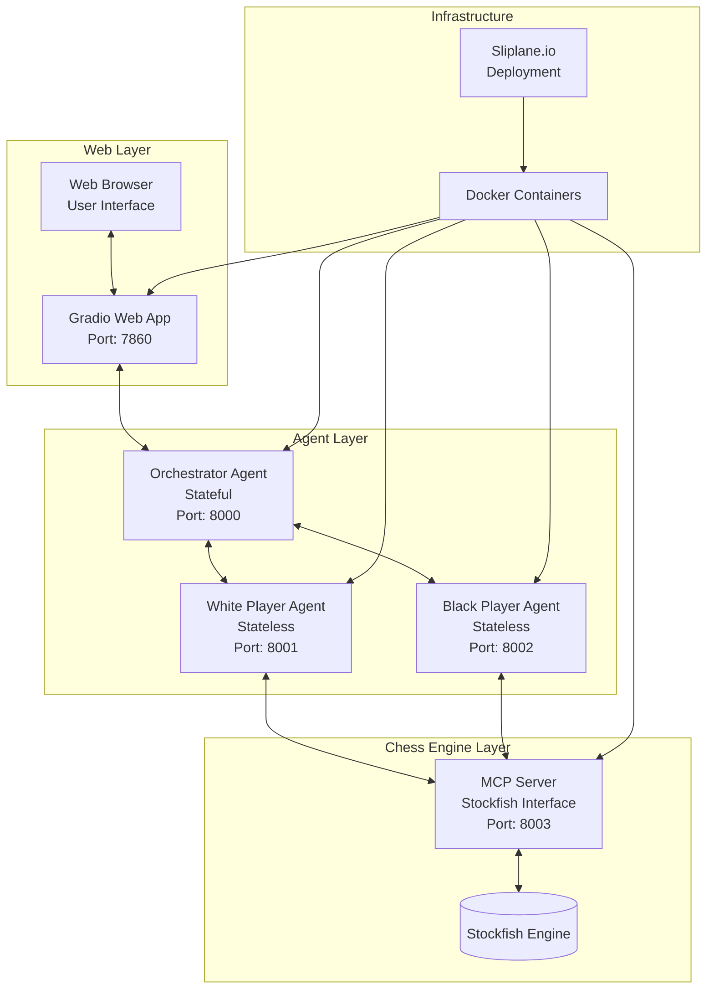

### 2.2 Component Responsibilities

| Component | Type | State | Primary Responsibilities |
|-----------|------|-------|-------------------------|
| **Orchestrator Agent** | Stateful | Persistent | Game state management, session handling, turn coordination, WebSocket server |
| **White Player Agent** | Stateless | Request-scoped | Generate moves for white pieces, move analysis |
| **Black Player Agent** | Stateless | Request-scoped | Generate moves for black pieces, move analysis |
| **MCP Server** | Stateless | Request-scoped | Chess engine integration, move validation, position analysis |
| **Gradio Web App** | Stateful | Session-based | User interface, game visualization, WebSocket client |

## 3. Communication Protocols

### 3.1 Protocol Stack

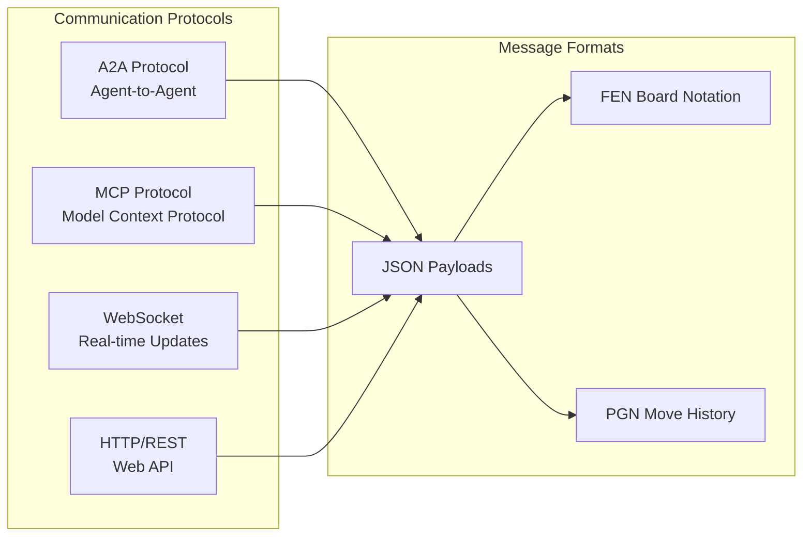

### 3.2 Message Flow Patterns

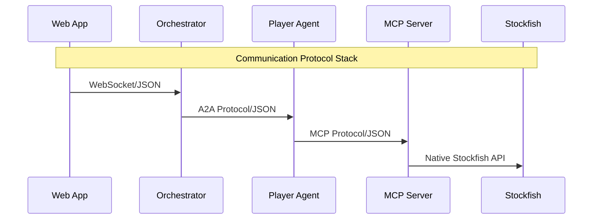

## 4. Detailed Sequence Diagrams

### 4.1 Game Initialization Flow

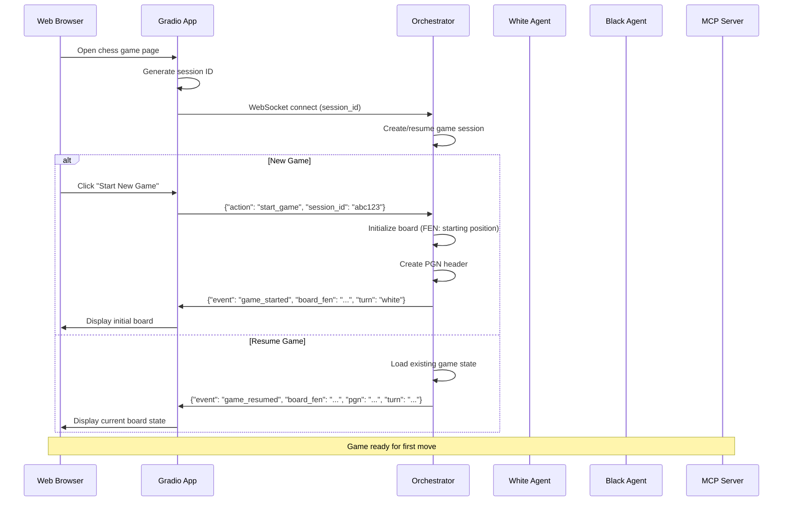

### 4.2 Move Processing Flow

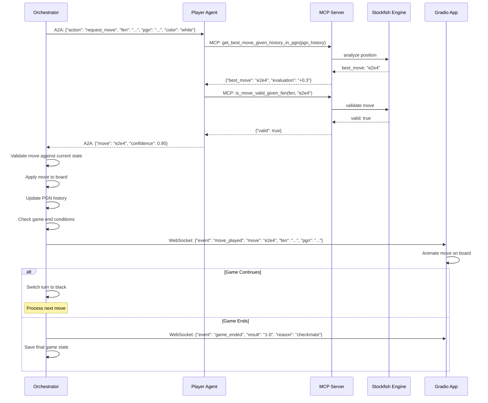

### 4.3 Error Handling Flow

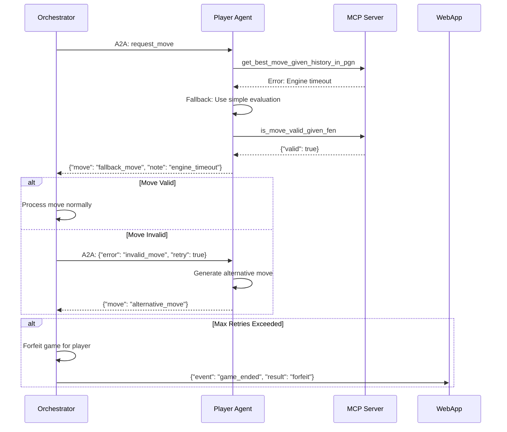

## 5. Data Models and Schemas

### 5.1 Core Data Structures

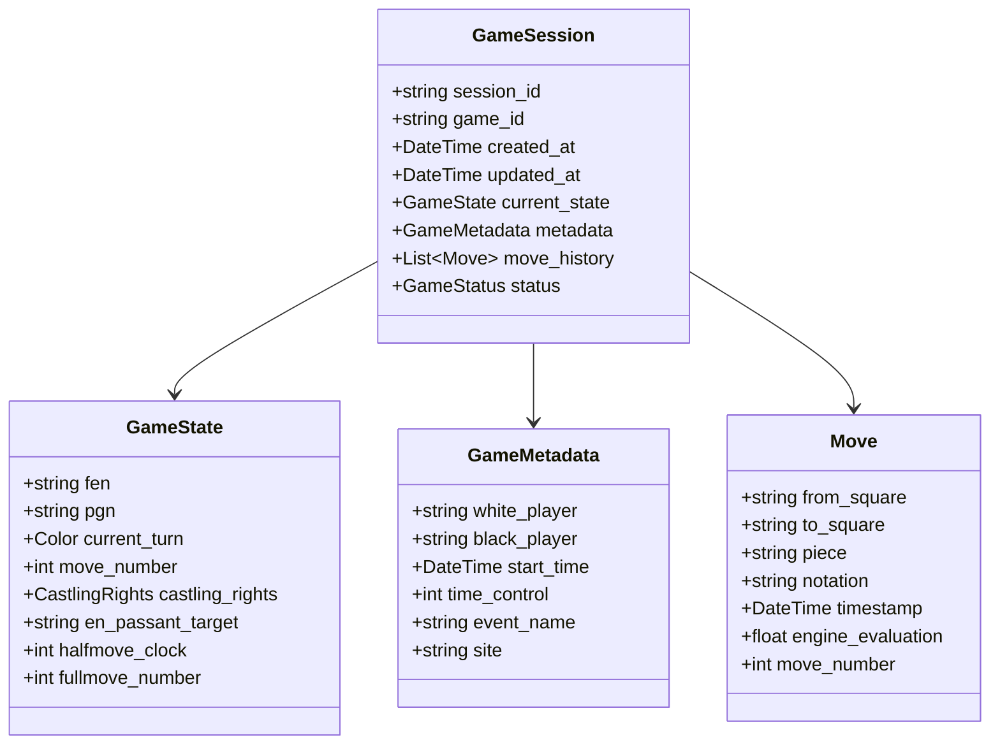

### 5.2 Message Schemas

#### A2A Protocol Messages

```json
// Move Request (Orchestrator → Player Agent)
{
  "message_type": "move_request",
  "session_id": "abc123",
  "game_id": "game_456",
  "current_fen": "rnbqkbnr/pppppppp/8/8/8/8/PPPPPPPP/RNBQKBNR w KQkq - 0 1",
  "pgn_history": "1. e4 e5 2. Nf3",
  "color": "white",
  "time_remaining": 300000,
  "timestamp": "2024-01-01T12:00:00Z"
}

// Move Response (Player Agent → Orchestrator)
{
  "message_type": "move_response",
  "session_id": "abc123",
  "move": "Nc3",
  "move_uci": "b1c3",
  "confidence": 0.87,
  "engine_evaluation": "+0.15",
  "thinking_time": 2.5,
  "timestamp": "2024-01-01T12:00:02Z"
}
```

#### MCP Tool Schemas

```json
// get_best_move_given_history_in_pgn
{
  "tool": "get_best_move_given_history_in_pgn",
  "parameters": {
    "pgn_history": "1. e4 e5 2. Nf3 Nc6",
    "depth": 15,
    "time_limit": 5.0
  }
}

// is_move_valid_given_fen
{
  "tool": "is_move_valid_given_fen",
  "parameters": {
    "fen": "rnbqkb1r/pppp1ppp/5n2/4p3/4P3/5N2/PPPP1PPP/RNBQKB1R w KQkq - 2 3",
    "move_uci": "f1c4"
  }
}
```

#### WebSocket Messages

```json
// Game State Update
{
  "event": "game_state_update",
  "session_id": "abc123",
  "board_fen": "rnbqkb1r/pppp1ppp/5n2/4p3/4P3/5N2/PPPP1PPP/RNBQKB1R w KQkq - 2 3",
  "pgn": "1. e4 e5 2. Nf3 Nc6 3. Bc4",
  "current_turn": "black",
  "move_number": 3,
  "last_move": {
    "from": "f1",
    "to": "c4",
    "piece": "bishop",
    "notation": "Bc4"
  },
  "game_status": "active"
}
```

## 6. Deployment Architecture

### 6.1 Container Architecture

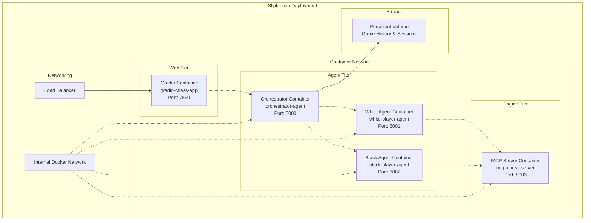

### 6.2 Service Discovery and Communication

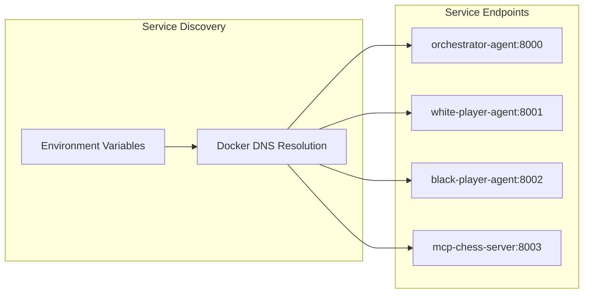

## 7. Technology Stack and Implementation Considerations

### 7.1 Core Libraries and Frameworks

| Component | Technology | Library/Framework | Version | Purpose |
|-----------|------------|-------------------|---------|---------|
| **Chess Logic** | Python | `python-chess` | ^1.999 | Board representation, move validation, PGN/FEN handling |
| **Chess Visualization** | Python | `chess.svg` | ^1.999 | SVG board generation |
| **Image Processing** | Python | `PIL`, `cairosvg` | ^10.0, ^2.7 | SVG to PNG conversion |
| **Agent Framework** | Python | `a2a-python` | ^0.1.0 | Agent-to-agent communication |
| **MCP Server** | Python | `fastmcp` | ^0.2.0 | Model Context Protocol implementation |
| **Chess Engine** | Binary | `stockfish` | ^15.0 | Move analysis and evaluation |
| **Web Interface** | Python | `gradio` | ^4.0 | Web application framework |
| **WebSocket** | Python | `websockets` | ^12.0 | Real-time communication |
| **HTTP Server** | Python | `fastapi` | ^0.104 | REST API endpoints |
| **Async Processing** | Python | `asyncio` | Built-in | Asynchronous operations |

### 7.2 Architecture Patterns

#### 7.2.1 Orchestrator Agent Pattern

```python
class OrchestratorAgent:
    """
    Stateful agent managing multiple concurrent games
    """
    def __init__(self):
        self.sessions: Dict[str, GameSession] = {}
        self.websocket_clients: Dict[str, WebSocket] = {}
        self.agent_clients = {
            'white': A2AClient('white-player-agent:8001'),
            'black': A2AClient('black-player-agent:8002')
        }
    
    async def handle_move_request(self, session_id: str):
        session = self.sessions[session_id]
        current_player = session.current_turn
        
        # Request move from appropriate agent
        move_response = await self.agent_clients[current_player].request_move(
            fen=session.current_fen,
            pgn=session.pgn_history
        )
        
        # Validate and apply move
        if self.validate_move(session, move_response.move):
            self.apply_move(session, move_response.move)
            await self.broadcast_game_state(session_id)
```

#### 7.2.2 Stateless Player Agent Pattern

```python
class PlayerAgent:
    """
    Stateless agent for move generation
    """
    def __init__(self, color: str):
        self.color = color
        self.mcp_client = MCPClient('mcp-chess-server:8003')
    
    async def generate_move(self, fen: str, pgn: str) -> Move:
        # Get best move from engine
        best_move = await self.mcp_client.call_tool(
            'get_best_move_given_history_in_pgn',
            {'pgn_history': pgn, 'depth': 15}
        )
        
        # Validate move
        is_valid = await self.mcp_client.call_tool(
            'is_move_valid_given_fen',
            {'fen': fen, 'move_uci': best_move.uci}
        )
        
        if is_valid:
            return best_move
        else:
            return await self.generate_fallback_move(fen)
```

### 7.3 Performance Considerations

#### 7.3.1 Concurrency Management

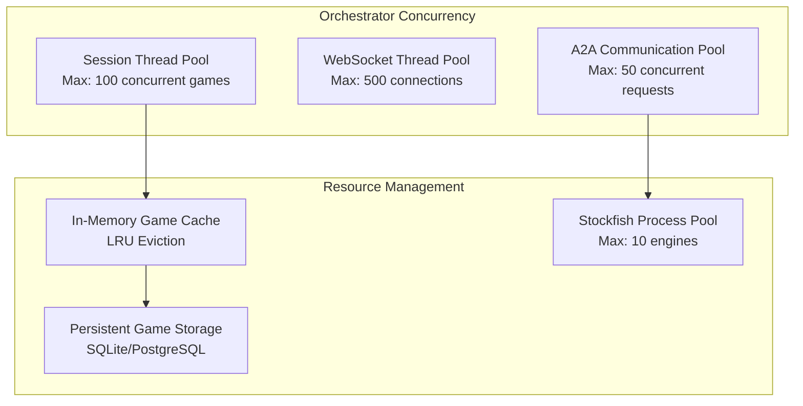

#### 7.3.2 Scalability Patterns

- **Horizontal Scaling**: Multiple orchestrator instances with session affinity
- **Caching Strategy**: Redis for session state and move caching
- **Database Sharding**: Session-based sharding for game history
- **Load Balancing**: Round-robin for player agents, sticky sessions for orchestrator

### 7.4 Error Handling and Resilience

#### 7.4.1 Fault Tolerance Mechanisms

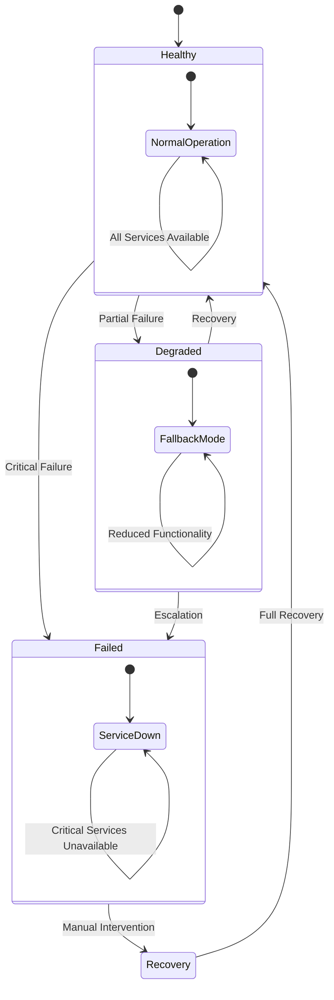

#### 7.4.2 Error Recovery Strategies

| Error Type | Recovery Strategy | Timeout | Retry Policy |
|------------|------------------|---------|--------------|
| **Agent Communication** | Circuit breaker with exponential backoff | 30s | 3 retries, 2s base delay |
| **Chess Engine Timeout** | Fallback to simpler evaluation | 10s | No retry, immediate fallback |
| **WebSocket Disconnect** | Automatic reconnection with session restore | 5s | Infinite retries, 1s interval |
| **Database Connection** | Connection pooling with health checks | 15s | 5 retries, 1s delay |

## 8. Security Considerations

### 8.1 Authentication and Authorization

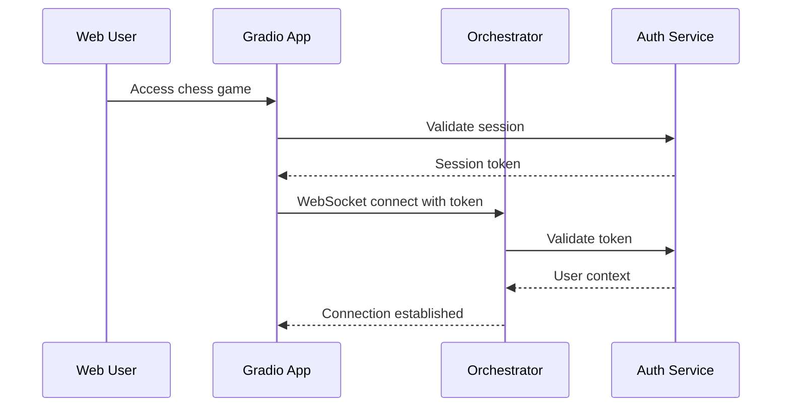

### 8.2 Security Measures

- **Input Validation**: All chess moves validated against legal move generation
- **Session Security**: JWT tokens with expiration for WebSocket authentication
- **Rate Limiting**: Request throttling to prevent abuse
- **Container Security**: Minimal base images, non-root users, read-only filesystems
- **Network Security**: Internal container network isolation
- **Data Protection**: Encryption at rest for game history, TLS in transit

## 9. Monitoring and Observability

### 9.1 Metrics and Monitoring

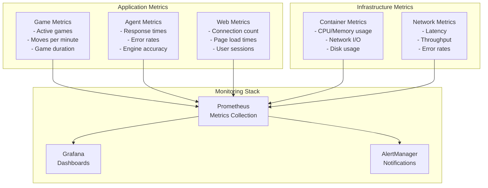

### 9.2 Logging Strategy

```json
{
  "timestamp": "2024-01-01T12:00:00.000Z",
  "level": "INFO",
  "service": "orchestrator",
  "session_id": "abc123",
  "event": "move_processed",
  "details": {
    "move": "e2e4",
    "player": "white",
    "engine_time": 1.5,
    "evaluation": "+0.3"
  },
  "trace_id": "xyz789"
}
```

## 10. Testing Strategy

### 10.1 Test Architecture

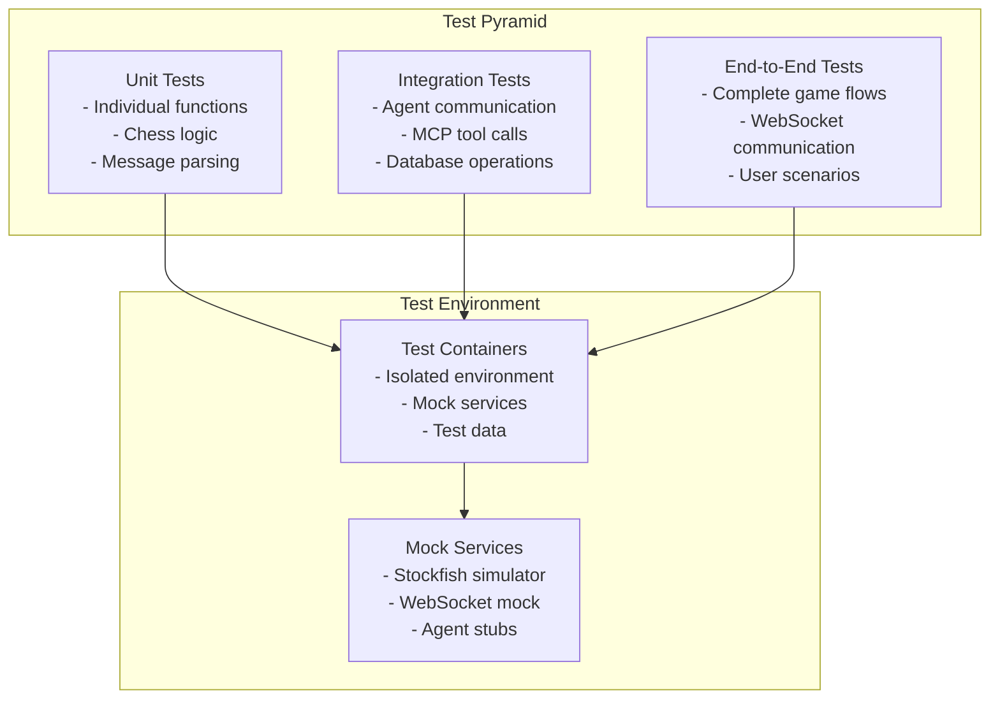

### 10.2 Test Scenarios

#### Critical Path Tests
1. **Complete Game Flow**: Start → Moves → End → Result
2. **Session Management**: Create → Pause → Resume → Archive
3. **Error Recovery**: Network failures → Agent timeouts → Invalid moves
4. **Concurrent Games**: Multiple sessions → Resource isolation → Performance

#### Edge Case Tests
1. **Chess Rules**: En passant, castling, promotion, stalemate
2. **Time Controls**: Move timeouts, game timeouts, time increment
3. **Network Issues**: Disconnections, reconnections, partial failures
4. **Load Testing**: High concurrent users, memory pressure, CPU stress

## 11. Deployment and DevOps

### 11.1 CI/CD Pipeline

```mermaid
graph LR
    subgraph "Development"
        Code[Code Changes]
        Tests[Automated Tests]
        Build[Docker Build]
    end
    
    subgraph "Staging"
        Deploy[Deploy to Staging]
        IntegrationTest[Integration Tests]
        Performance[Performance Tests]
    end
    
    subgraph "Production"
        ProdDeploy[Deploy to Production]
        Monitor[Health Monitoring]
        Rollback[Automated Rollback]
    end
    
    Code --> Tests
    Tests --> Build
    Build --> Deploy
    Deploy --> IntegrationTest
    IntegrationTest --> Performance
    Performance --> ProdDeploy
    ProdDeploy --> Monitor
    Monitor --> Rollback
```

### 11.2 Configuration Management

```yaml
# docker-compose.yml
version: '3.8'
services:
  orchestrator:
    build: ./orchestrator
    environment:
      - REDIS_URL=redis://redis:6379
      - DATABASE_URL=postgresql://postgres:password@db:5432/chess
    depends_on:
      - redis
      - db
    networks:
      - chess-network

  white-agent:
    build: ./agents/white
    environment:
      - MCP_SERVER_URL=http://mcp-server:8003
    networks:
      - chess-network

  mcp-server:
    build: ./mcp-server
    volumes:
      - stockfish-engines:/opt/stockfish
    networks:
      - chess-network

networks:
  chess-network:
    driver: bridge
```

## 12. Future Enhancements and Extensibility

### 12.1 Planned Extensions

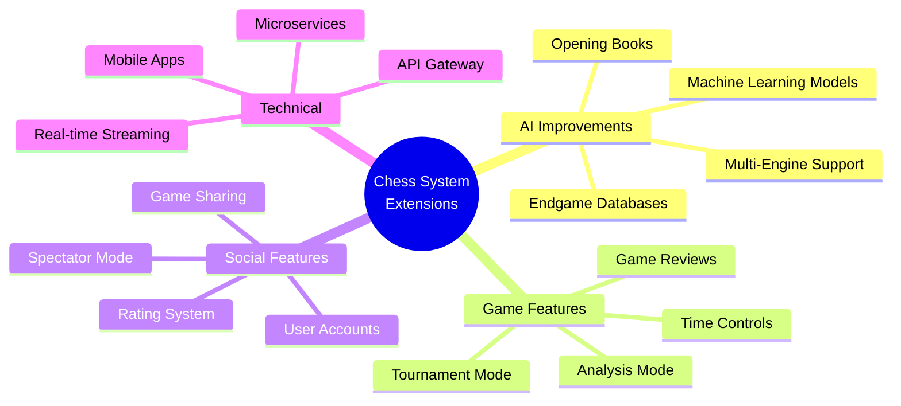

### 12.2 Extensibility Points

1. **Player Agent Plugins**: Support for different AI engines and strategies
2. **Game Variants**: Chess960, King of the Hill, Three-Check
3. **Analysis Tools**: Position evaluation, move suggestions, game analysis
4. **Integration APIs**: External chess platforms, rating systems, databases

This technical design provides a comprehensive foundation for implementing the multi-agent chess system with clear architecture, well-defined interfaces, and robust implementation considerations.