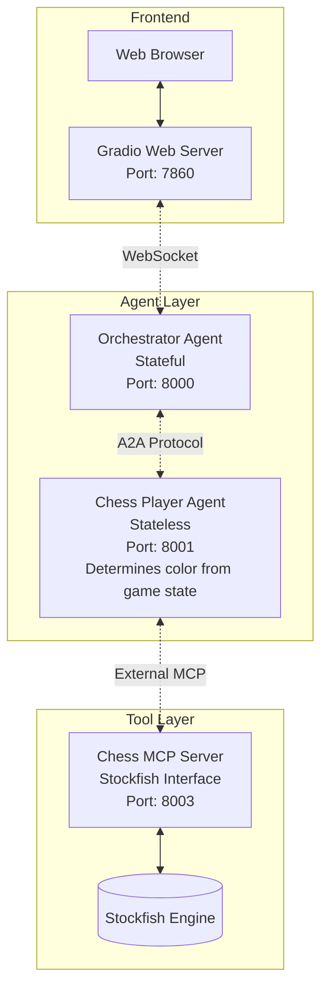

# Multi-Agent Chess System Implementation Plan

## 1. Architectural Breakdown

### 1.1 System Overview

The multi-agent chess system consists of four containerized components communicating through defined protocols:

1. **Orchestrator Agent Server** (Stateful) - Port 8000
2. **Chess Player Agent Server** (Stateless) - Port 8001  
3. **MCP Chess Server** (Stateless) - Port 8003
4. **Gradio Web Server** - Port 7860

Note: The player agent is stateless and determines its color from the game state, eliminating the need for separate white/black agents.

### 1.2 Communication Architecture



### 1.3 Component Responsibilities

#### Orchestrator Agent Server
- **Stateful**: Maintains game sessions and state
- **Sessions**: Manages multiple concurrent chess games
- **Coordination**: Orchestrates game flow between player agents
- **WebSocket**: Real-time communication with Gradio frontend
- **A2A Server**: Receives move requests and coordinates turns

#### Chess Player Agent Server  
- **Stateless**: Receives game state via A2A messages and determines color from FEN
- **FastMCPAgent**: Integrates with external MCP chess server
- **A2A Client**: Communicates with orchestrator for game coordination
- **Strategy**: Makes chess moves using Stockfish analysis for both white and black

#### Chess MCP Server
- **Stockfish Integration**: Provides chess engine capabilities
- **Tool Provider**: Exposes chess analysis tools via MCP protocol
- **Stateless**: No persistent state, pure function server
- **External**: Serves multiple A2A agents simultaneously

#### Gradio Web Server
- **User Interface**: Chess board visualization and controls
- **Session Management**: Handle multiple user sessions
- **WebSocket Client**: Real-time communication with orchestrator
- **Game Display**: Show move history, game status, and controls

## 2. Detailed Folder Structure

```
chess-multi-agent/
├── package.json                        # Root package.json with turbo + tooling
├── pnpm-workspace.yaml                 # pnpm workspace configuration  
├── turbo.json                          # Turbo pipeline configuration
├── .pre-commit-config.yaml             # Pre-commit hooks configuration
├── pyproject.toml                      # Root Python project configuration
├── docker-compose.dev.yml              # Development container orchestration
├── .env.example                        # Environment template
├── README.md                          # Setup and deployment guide
│
├── orchestrator-agent/                 # Stateful game coordinator
│   ├── Dockerfile                      # uv-based container
│   ├── pyproject.toml                 # Dependencies with python-a2a
│   ├── pytest.ini                     # Pytest configuration
│   ├── .env                          # Environment configuration
│   ├── orchestrator_server.py        # Main A2A server entry point
│   ├── game_manager.py              # Game session management
│   ├── chess_tools.py               # Built-in chess utilities
│   ├── websocket_handler.py         # WebSocket communication
│   ├── models/                      # Data models
│   │   ├── __init__.py
│   │   ├── game_state.py           # Game state representation
│   │   └── session.py              # Session data models
│   └── tests/                       # Test suite
│       ├── __init__.py
│       ├── conftest.py             # Shared test fixtures
│       ├── test_orchestrator_server.py # A2A server tests
│       ├── test_game_manager.py    # Game session management tests
│       ├── test_chess_tools.py     # Chess utilities tests
│       ├── test_websocket_handler.py # WebSocket tests
│       └── test_models/            # Model tests
│           ├── __init__.py
│           ├── test_game_state.py  # Game state tests
│           └── test_session.py     # Session model tests
│
├── chess-player-agent/              # Stateless player for both colors
│   ├── Dockerfile                   # uv-based container
│   ├── pyproject.toml              # Dependencies with FastMCPAgent
│   ├── pytest.ini                  # Pytest configuration
│   ├── .env                        # Environment configuration  
│   ├── player_agent_server.py      # Main A2A agent server
│   ├── chess_player.py             # Chess playing logic
│   └── tests/                       # Test suite
│       ├── __init__.py
│       ├── conftest.py             # Shared test fixtures and mocks
│       ├── test_player_agent_server.py # A2A agent server tests
│       └── test_chess_player.py    # Chess playing logic tests
│
├── chess-mcp-server/                # External MCP tool provider
│   ├── Dockerfile                  # uv-based container with Stockfish
│   ├── pyproject.toml             # Dependencies with python-a2a FastMCP
│   ├── pytest.ini                 # Pytest configuration
│   ├── .env                       # Environment configuration
│   ├── chess_mcp_server.py        # Main FastMCP server
│   ├── tools/                     # MCP tool implementations
│   │   ├── __init__.py
│   │   ├── move_tools.py          # Move validation and execution
│   │   ├── analysis_tools.py      # Position analysis tools
│   │   └── engine_tools.py        # Stockfish integration tools
│   ├── utils/                     # Utility functions
│   │   ├── __init__.py
│   │   ├── chess_utils.py         # Chess helper functions
│   │   └── stockfish_manager.py   # Engine connection management
│   └── tests/                     # Test suite
│       ├── __init__.py
│       ├── conftest.py           # Shared test fixtures and mocks
│       ├── test_chess_mcp_server.py # FastMCP server tests
│       ├── test_tools/           # MCP tool tests
│       │   ├── __init__.py
│       │   ├── test_move_tools.py # Move validation tests
│       │   ├── test_analysis_tools.py # Analysis tool tests
│       │   └── test_engine_tools.py # Engine integration tests
│       └── test_utils/           # Utility tests
│           ├── __init__.py
│           ├── test_chess_utils.py # Chess helper tests
│           └── test_stockfish_manager.py # Engine manager tests
│
└── gradio-web/                     # Web interface server
    ├── Dockerfile                  # uv-based container
    ├── pyproject.toml             # Dependencies with Gradio + WebSockets
    ├── pytest.ini                 # Pytest configuration
    ├── .env                       # Environment configuration
    ├── chess_web_app.py           # Main Gradio application
    ├── session_manager.py         # User session handling
    ├── websocket_client.py        # Orchestrator communication
    ├── components/                # UI components
    │   ├── __init__.py
    │   ├── chess_board.py         # Board visualization
    │   ├── move_history.py        # Move history display
    │   └── game_controls.py       # Game control buttons
    ├── static/                    # Static assets
    │   ├── chess_pieces/          # Chess piece images
    │   └── styles.css             # Custom styling
    ├── utils/                     # Utility functions
    │   ├── __init__.py
    │   └── chess_display.py       # Display helper functions
    └── tests/                     # Test suite
        ├── __init__.py
        ├── conftest.py           # Shared test fixtures and mocks
        ├── test_chess_web_app.py # Gradio app tests
        ├── test_session_manager.py # Session management tests
        ├── test_websocket_client.py # WebSocket client tests
        ├── test_components/      # Component tests
        │   ├── __init__.py
        │   ├── test_chess_board.py # Board visualization tests
        │   ├── test_move_history.py # Move history tests
        │   └── test_game_controls.py # Game controls tests
        └── test_utils/           # Utility tests
            ├── __init__.py
            └── test_chess_display.py # Display helper tests
```

## 3. Component Implementation Details

### 3.1 Orchestrator Agent Server

#### Files and Purposes:

**orchestrator_server.py** - Main entry point
```python
class OrchestratorAgent(A2AServer):
    """Stateful orchestrator managing chess games."""
    def __init__(self):
        super().__init__()
        self.game_manager = GameManager()
        self.websocket_handler = WebSocketHandler()
    
    async def handle_new_game(self, session_id: str) -> dict
    async def handle_move_request(self, session_id: str, move_data: dict) -> dict
    async def coordinate_turn(self, session_id: str) -> dict
    def start_server(self)
```

**game_manager.py** - Session and game state management
```python
class GameManager:
    """Manages multiple concurrent chess game sessions."""
    def __init__(self):
        self.active_games: Dict[str, ChessGameState] = {}
    
    def create_session(self, session_id: str) -> ChessGameState
    def get_session(self, session_id: str) -> Optional[ChessGameState]
    def update_game_state(self, session_id: str, move: str) -> bool
    def get_game_status(self, session_id: str) -> dict
    def cleanup_expired_sessions(self)
```

**chess_tools.py** - Built-in chess utilities
```python
class ChessTools:
    """Built-in chess utilities for the orchestrator."""
    @staticmethod
    def validate_move_format(move_uci: str) -> bool
    @staticmethod
    def convert_fen_to_display(fen: str) -> dict
    @staticmethod
    def is_game_over(fen: str) -> dict
    @staticmethod
    def get_legal_moves(fen: str) -> List[str]
```

**websocket_handler.py** - WebSocket communication
```python
class WebSocketHandler:
    """Handles WebSocket communication with Gradio frontend."""
    def __init__(self):
        self.connected_clients: Dict[str, WebSocket] = {}
    
    async def handle_connection(self, websocket: WebSocket, session_id: str)
    async def broadcast_game_update(self, session_id: str, game_state: dict)
    async def send_move_update(self, session_id: str, move_data: dict)
    async def handle_disconnect(self, session_id: str)
```

**models/game_state.py** - Game state representation
```python
@dataclass
class ChessGameState:
    """Represents the complete state of a chess game."""
    session_id: str
    current_fen: str
    move_history: List[str]
    pgn_history: str
    current_turn: str  # 'white' or 'black'
    game_status: str   # 'active', 'checkmate', 'stalemate', 'draw'
    created_at: datetime
    last_move_at: datetime
    
    def to_dict(self) -> dict
    def from_dict(cls, data: dict) -> 'ChessGameState'
    def add_move(self, move_uci: str, new_fen: str)
    def is_expired(self, timeout_minutes: int = 30) -> bool
```

#### Dockerfile:
```dockerfile
FROM python:3.10-slim
WORKDIR /usr/src/app
RUN apt-get update && apt-get install -y curl && rm -rf /var/lib/apt/lists/*
RUN curl -LsSf https://astral.sh/uv/install.sh | sh
ENV PATH="/root/.cargo/bin:$PATH"
COPY pyproject.toml uv.lock ./
RUN uv sync --frozen
COPY . .
EXPOSE 8000
ENV PYTHONUNBUFFERED=1
CMD ["uv", "run", "orchestrator_server.py"]
```

#### .env:
```env
ORCHESTRATOR_HOST=0.0.0.0
ORCHESTRATOR_PORT=8000
WHITE_AGENT_URL=http://white-player-agent:8001
BLACK_AGENT_URL=http://black-player-agent:8002
SESSION_TIMEOUT_MINUTES=30
LOG_LEVEL=INFO
```

### 3.2 Chess Player Agent Server

#### Files and Purposes:

**player_agent_server.py** - Main agent server
```python
class ChessPlayerAgent(A2AServer, FastMCPAgent):
    """Stateless chess player agent with MCP integration for both colors."""
    def __init__(self, mcp_server_url: str):
        A2AServer.__init__(self)
        FastMCPAgent.__init__(self, mcp_servers={"chess": mcp_server_url})
    
    def determine_color_from_fen(self, fen: str) -> str:
        """Determine which color to play based on FEN active color."""
        return fen.split()[1]  # 'w' or 'b' from FEN
    
    async def handle_move_request(self, game_state: dict) -> dict
    async def make_move(self, fen: str, move_history: List[str]) -> dict
    async def validate_opponent_move(self, fen: str, move_uci: str) -> dict
    def start_server(self)
```

**chess_player.py** - Chess playing logic
```python
class ChessPlayer:
    """Core chess playing functionality for both colors."""
    def __init__(self, mcp_client):
        self.mcp_client = mcp_client
    
    def get_current_color(self, fen: str) -> str:
        """Extract current player color from FEN string."""
        return 'white' if fen.split()[1] == 'w' else 'black'
    
    async def analyze_position(self, fen: str) -> dict
    async def get_best_move(self, fen: str, time_limit: float = 2.0) -> str
    async def evaluate_move(self, fen: str, move_uci: str) -> dict
    def format_move_response(self, move_uci: str, analysis: dict, color: str) -> dict
```


#### Dockerfile:
```dockerfile
FROM python:3.10-slim
WORKDIR /usr/src/app
RUN apt-get update && apt-get install -y curl && rm -rf /var/lib/apt/lists/*
RUN curl -LsSf https://astral.sh/uv/install.sh | sh
ENV PATH="/root/.cargo/bin:$PATH"
COPY pyproject.toml uv.lock ./
RUN uv sync --frozen
COPY . .
EXPOSE 8001
ENV PYTHONUNBUFFERED=1
CMD ["uv", "run", "player_agent_server.py"]
```

#### .env file:
```env
AGENT_HOST=0.0.0.0
AGENT_PORT=8001
CHESS_MCP_URL=http://chess-mcp-server:8003
ORCHESTRATOR_URL=http://orchestrator-agent:8000
MOVE_TIME_LIMIT=2.0
LOG_LEVEL=INFO
```

### 3.3 Chess MCP Server

#### Files and Purposes:

**chess_mcp_server.py** - Main FastMCP server
```python
from python_a2a import FastMCP

chess_mcp = FastMCP(name="chess-server")

@chess_mcp.tool
def validate_move(fen: str, move_uci: str) -> dict

@chess_mcp.tool  
def make_move(fen: str, move_uci: str) -> dict

@chess_mcp.tool
def get_stockfish_move(fen: str, time_limit: float = 2.0) -> dict

@chess_mcp.tool
def analyze_position(fen: str, depth: int = 15) -> dict

@chess_mcp.tool
def get_game_status(fen: str) -> dict

def start_chess_mcp_server():
    chess_mcp.run()
```

**tools/move_tools.py** - Move validation and execution
```python
class MoveTools:
    """Chess move validation and execution tools."""
    @staticmethod
    def validate_move_uci(fen: str, move_uci: str) -> dict
    @staticmethod
    def execute_move(fen: str, move_uci: str) -> dict
    @staticmethod
    def get_legal_moves(fen: str) -> List[str]
    @staticmethod
    def is_move_capture(fen: str, move_uci: str) -> bool
```

**tools/analysis_tools.py** - Position analysis tools
```python
class AnalysisTools:
    """Chess position analysis tools."""
    @staticmethod
    def evaluate_position(fen: str, depth: int = 15) -> dict
    @staticmethod
    def get_best_lines(fen: str, num_lines: int = 3) -> List[dict]
    @staticmethod
    def detect_tactics(fen: str) -> dict
    @staticmethod
    def get_opening_name(move_history: List[str]) -> str
```

**tools/engine_tools.py** - Stockfish integration
```python
class EngineTools:
    """Stockfish chess engine integration."""
    def __init__(self, engine_path: str = "/usr/games/stockfish"):
        self.engine_path = engine_path
    
    async def get_best_move(self, fen: str, time_limit: float) -> dict
    async def analyze_position(self, fen: str, depth: int) -> dict
    async def get_evaluation(self, fen: str) -> float
    def is_engine_available(self) -> bool
```

**utils/stockfish_manager.py** - Engine connection management
```python
class StockfishManager:
    """Manages Stockfish engine connections and pooling."""
    def __init__(self, max_connections: int = 5):
        self.max_connections = max_connections
        self.connection_pool: List[chess.engine.SimpleEngine] = []
    
    async def get_engine(self) -> chess.engine.SimpleEngine
    async def return_engine(self, engine: chess.engine.SimpleEngine)
    async def close_all_engines(self)
    def health_check(self) -> dict
```

#### Dockerfile:
```dockerfile
FROM python:3.10-slim
WORKDIR /usr/src/app
RUN apt-get update && apt-get install -y \
    stockfish \
    curl \
    && rm -rf /var/lib/apt/lists/*
RUN curl -LsSf https://astral.sh/uv/install.sh | sh
ENV PATH="/root/.cargo/bin:$PATH"
COPY pyproject.toml uv.lock ./
RUN uv sync --frozen
COPY . .
EXPOSE 8003
ENV PYTHONUNBUFFERED=1
ENV STOCKFISH_PATH=/usr/games/stockfish
CMD ["uv", "run", "chess_mcp_server.py"]
```

#### .env:
```env
MCP_SERVER_HOST=0.0.0.0
MCP_SERVER_PORT=8003
STOCKFISH_PATH=/usr/games/stockfish
STOCKFISH_THREADS=1
STOCKFISH_MEMORY=128
MAX_ENGINE_CONNECTIONS=5
DEFAULT_TIME_LIMIT=2.0
DEFAULT_ANALYSIS_DEPTH=15
LOG_LEVEL=INFO
```

### 3.4 Gradio Web Server

#### Files and Purposes:

**chess_web_app.py** - Main Gradio application
```python
import gradio as gr

class ChessWebApp:
    """Main Gradio chess web application."""
    def __init__(self):
        self.session_manager = SessionManager()
        self.websocket_client = WebSocketClient()
    
    def create_interface(self) -> gr.Interface
    def handle_new_game(self, session_id: str) -> tuple
    def handle_user_move(self, session_id: str, move: str) -> tuple  
    def update_board_display(self, game_state: dict) -> dict
    def launch_app(self)
```

**session_manager.py** - User session handling
```python
class SessionManager:
    """Manages user sessions for the web interface."""
    def __init__(self):
        self.active_sessions: Dict[str, UserSession] = {}
    
    def create_session(self, user_id: str = None) -> str
    def get_session(self, session_id: str) -> Optional[UserSession]
    def update_session_state(self, session_id: str, game_state: dict)
    def cleanup_expired_sessions(self)

@dataclass
class UserSession:
    session_id: str
    user_id: Optional[str]
    game_state: Optional[dict]
    created_at: datetime
    last_activity: datetime
    websocket_connection: Optional[WebSocket]
```

**websocket_client.py** - Orchestrator communication
```python
class WebSocketClient:
    """WebSocket client for communicating with orchestrator."""
    def __init__(self, orchestrator_url: str):
        self.orchestrator_url = orchestrator_url
        self.connections: Dict[str, WebSocket] = {}
    
    async def connect_to_orchestrator(self, session_id: str) -> WebSocket
    async def send_move_request(self, session_id: str, move_data: dict)
    async def listen_for_updates(self, session_id: str, callback)
    async def disconnect_session(self, session_id: str)
```

**components/chess_board.py** - Board visualization
```python
class ChessBoardComponent:
    """Chess board visualization component."""
    def __init__(self):
        self.piece_images = self.load_piece_images()
    
    def render_board(self, fen: str, highlight_moves: List[str] = None) -> str
    def generate_board_html(self, board_state: dict) -> str
    def handle_square_click(self, square: str, session_id: str)
    def load_piece_images(self) -> Dict[str, str]
```

**components/move_history.py** - Move history display
```python
class MoveHistoryComponent:
    """Move history display component."""
    def render_move_history(self, moves: List[str], current_move: int = -1) -> str
    def format_move_pair(self, white_move: str, black_move: str, move_num: int) -> str
    def highlight_current_move(self, move_index: int)
    def export_pgn(self, game_state: dict) -> str
```

**components/game_controls.py** - Game control buttons
```python
class GameControlsComponent:
    """Game control buttons and settings."""
    def create_control_panel(self) -> gr.Group
    def handle_new_game(self, session_id: str)
    def handle_resign(self, session_id: str)  
    def handle_offer_draw(self, session_id: str)
    def toggle_auto_play(self, session_id: str, enabled: bool)
```

#### Dockerfile:
```dockerfile
FROM python:3.10-slim
WORKDIR /usr/src/app
RUN apt-get update && apt-get install -y curl && rm -rf /var/lib/apt/lists/*
RUN curl -LsSf https://astral.sh/uv/install.sh | sh
ENV PATH="/root/.cargo/bin:$PATH"
COPY pyproject.toml uv.lock ./
RUN uv sync --frozen
COPY . .
EXPOSE 7860
ENV PYTHONUNBUFFERED=1
ENV GRADIO_SERVER_NAME=0.0.0.0
CMD ["uv", "run", "chess_web_app.py"]
```

#### .env:
```env
GRADIO_HOST=0.0.0.0
GRADIO_PORT=7860
ORCHESTRATOR_WS_URL=ws://orchestrator-agent:8000/ws
SESSION_TIMEOUT_MINUTES=60
ENABLE_AUTO_PLAY=true
BOARD_THEME=default
LOG_LEVEL=INFO
```

## 4. Deployment Strategy

### 4.1 Production Deployment - Sliplane.io

Each component is deployed as a separate container on Sliplane.io for production:

#### Orchestrator Agent - sliplane.io
- **Container**: `chess-orchestrator-agent`
- **Port**: 8000
- **Environment Variables**:
  - `PLAYER_AGENT_URL=https://chess-player-agent.sliplane.app`
  - `SESSION_TIMEOUT_MINUTES=30`

#### Chess Player Agent - sliplane.io  
- **Container**: `chess-player-agent`
- **Port**: 8001
- **Environment Variables**:
  - `CHESS_MCP_URL=https://chess-mcp-server.sliplane.app`
  - `MOVE_TIME_LIMIT=2.0`

#### Chess MCP Server - sliplane.io
- **Container**: `chess-mcp-server`
- **Port**: 8003
- **Environment Variables**:
  - `STOCKFISH_PATH=/usr/games/stockfish`
  - `MAX_ENGINE_CONNECTIONS=5`

#### Gradio Web App - sliplane.io
- **Container**: `chess-gradio-web`
- **Port**: 7860
- **Environment Variables**:
  - `ORCHESTRATOR_WS_URL=wss://chess-orchestrator-agent.sliplane.app/ws`
  - `GRADIO_SERVER_NAME=0.0.0.0`

### 4.2 Development Docker Compose

**docker-compose.dev.yml** - For local development only:
```yaml
version: '3.8'

services:
  chess-mcp-server:
    build: ./chess-mcp-server
    ports:
      - "8003:8003"
    environment:
      - STOCKFISH_PATH=/usr/games/stockfish
      - LOG_LEVEL=DEBUG
    volumes:
      - ./chess-mcp-server:/usr/src/app
    command: ["uv", "run", "python", "-m", "debugpy", "--listen", "0.0.0.0:5678", "--wait-for-client", "chess_mcp_server.py"]

  chess-player-agent:
    build: ./chess-player-agent
    ports:
      - "8001:8001"
      - "5679:5679"  # Debug port
    environment:
      - CHESS_MCP_URL=http://chess-mcp-server:8003
      - LOG_LEVEL=DEBUG
    depends_on:
      - chess-mcp-server
    volumes:
      - ./chess-player-agent:/usr/src/app
    command: ["uv", "run", "python", "-m", "debugpy", "--listen", "0.0.0.0:5679", "--wait-for-client", "player_agent_server.py"]

  orchestrator-agent:
    build: ./orchestrator-agent
    ports:
      - "8000:8000"
      - "5680:5680"  # Debug port
    environment:
      - PLAYER_AGENT_URL=http://chess-player-agent:8001
      - LOG_LEVEL=DEBUG
    depends_on:
      - chess-player-agent
    volumes:
      - ./orchestrator-agent:/usr/src/app
    command: ["uv", "run", "python", "-m", "debugpy", "--listen", "0.0.0.0:5680", "--wait-for-client", "orchestrator_server.py"]

  gradio-web:
    build: ./gradio-web
    ports:
      - "7860:7860"
      - "5681:5681"  # Debug port
    environment:
      - ORCHESTRATOR_WS_URL=ws://orchestrator-agent:8000/ws
      - LOG_LEVEL=DEBUG
    depends_on:
      - orchestrator-agent
    volumes:
      - ./gradio-web:/usr/src/app
    command: ["uv", "run", "python", "-m", "debugpy", "--listen", "0.0.0.0:5681", "--wait-for-client", "chess_web_app.py"]

networks:
  default:
    driver: bridge

# Optional: Development database for session persistence
  # postgres-dev:
  #   image: postgres:15-alpine
  #   ports:
  #     - "5432:5432"
  #   environment:
  #     - POSTGRES_DB=chess_dev
  #     - POSTGRES_USER=chess_user
  #     - POSTGRES_PASSWORD=chess_pass
  #   volumes:
  #     - postgres_dev_data:/var/lib/postgresql/data

# volumes:
#   postgres_dev_data:
```

### 4.3 Individual Container Deployment

Each Dockerfile is optimized for standalone deployment:

#### Production Dockerfile Optimizations
```dockerfile
# Multi-stage build for smaller production images
FROM python:3.10-slim as builder
# ... build stage ...

FROM python:3.10-slim as production
# ... minimal production stage ...

# Health check for container orchestration
HEALTHCHECK --interval=30s --timeout=10s --start-period=5s --retries=3 \
    CMD curl -f http://localhost:${PORT:-8000}/health || exit 1

# Non-root user for security
RUN useradd -m -u 1001 appuser
USER appuser
```

## 5. pyproject.toml Dependencies

### Orchestrator Agent:
```toml
[project]
dependencies = [
    "python-a2a>=0.1.0",
    "python-chess>=1.999",
    "fastapi>=0.104.0",
    "websockets>=11.0",
    "uvicorn>=0.24.0",
]
```

### Player Agent:
```toml
[project]
dependencies = [
    "python-a2a>=0.1.0",
    "python-chess>=1.999",
    "httpx>=0.25.0",
]
```

### MCP Server:
```toml
[project]
dependencies = [
    "python-a2a>=0.1.0",
    "python-chess>=1.999",
    "stockfish>=3.28.0",
]
```

### Gradio Web:
```toml
[project]
dependencies = [
    "gradio>=4.0.0",
    "websockets>=11.0",
    "python-chess>=1.999",
    "httpx>=0.25.0",
]
```

## 6. Key Benefits of Single Player Agent

### 6.1 Architectural Advantages
- **Simplified Deployment**: Only one player agent container instead of two
- **Resource Efficiency**: 25% fewer containers and reduced memory footprint
- **Code Reuse**: Single codebase handles both colors based on game state
- **Easier Maintenance**: Updates only need to be applied to one component

### 6.2 Implementation Benefits  
- **Stateless Design**: Color determination happens dynamically from FEN
- **Flexible Strategy**: Can implement different strategies for white vs black if desired
- **Load Balancing**: Single agent can handle multiple games of different colors
- **Testing Simplification**: One component to test instead of two

### 6.3 Game Flow with Single Agent
1. Orchestrator sends game state (FEN + move history) to player agent
2. Player agent extracts current color from FEN (`fen.split()[1]`)
3. Agent calls MCP server for move analysis  
4. Agent returns move to orchestrator with color context
5. Orchestrator updates game state and sends to opponent (same agent, different turn)

## 7. Testing Strategy and Implementation

### 7.1 Testing Philosophy

Each component follows a comprehensive testing approach using pytest with mono-repo structure:

- **Unit Tests**: Test individual functions and classes in isolation
- **Integration Tests**: Test component interactions and external dependencies
- **Mock-Heavy**: Mock external services (MCP servers, Stockfish, WebSockets)
- **Fixture-Based**: Reusable test data and setup across test modules
- **Async Testing**: Full support for async/await patterns in A2A and MCP

### 7.2 Orchestrator Agent Tests

#### tests/conftest.py - Shared Fixtures
```python
import pytest
import asyncio
from unittest.mock import AsyncMock, MagicMock
from models.game_state import ChessGameState
from game_manager import GameManager

@pytest.fixture
def event_loop():
    """Create an instance of the default event loop for the test session."""
    loop = asyncio.new_event_loop()
    yield loop
    loop.close()

@pytest.fixture
def sample_game_state():
    """Sample chess game state for testing."""
    return ChessGameState(
        session_id="test-session-123",
        current_fen="rnbqkbnr/pppppppp/8/8/8/8/PPPPPPPP/RNBQKBNR w KQkq - 0 1",
        move_history=[],
        pgn_history="",
        current_turn="white",
        game_status="active",
        created_at=datetime.utcnow(),
        last_move_at=datetime.utcnow()
    )

@pytest.fixture
def game_manager():
    """Game manager instance for testing."""
    return GameManager()

@pytest.fixture  
def mock_websocket():
    """Mock WebSocket for testing."""
    websocket = AsyncMock()
    websocket.send = AsyncMock()
    websocket.receive = AsyncMock()
    return websocket

@pytest.fixture
def mock_player_agent():
    """Mock player agent responses."""
    agent = AsyncMock()
    agent.make_move = AsyncMock(return_value={
        "success": True,
        "move_uci": "e2e4",
        "new_fen": "rnbqkbnr/pppppppp/8/8/4P3/8/PPPP1PPP/RNBQKBNR b KQkq e3 0 1"
    })
    return agent
```

#### tests/test_orchestrator_server.py - A2A Server Tests
```python
import pytest
from unittest.mock import patch, AsyncMock
from orchestrator_server import OrchestratorAgent

class TestOrchestratorAgent:
    
    @pytest.mark.asyncio
    async def test_handle_new_game(self, game_manager, sample_game_state):
        """Test creating a new game session."""
        orchestrator = OrchestratorAgent()
        orchestrator.game_manager = game_manager
        
        result = await orchestrator.handle_new_game("test-session-123")
        
        assert result["success"] is True
        assert result["session_id"] == "test-session-123"
        assert "current_fen" in result
    
    @pytest.mark.asyncio
    async def test_handle_move_request(self, game_manager, mock_player_agent):
        """Test handling move requests."""
        with patch('orchestrator_server.PlayerAgentClient', return_value=mock_player_agent):
            orchestrator = OrchestratorAgent()
            orchestrator.game_manager = game_manager
            
            # Create test game first
            await orchestrator.handle_new_game("test-session")
            
            move_data = {"session_id": "test-session", "move_uci": "e2e4"}
            result = await orchestrator.handle_move_request("test-session", move_data)
            
            assert result["success"] is True
            mock_player_agent.make_move.assert_called_once()
    
    @pytest.mark.asyncio
    async def test_coordinate_turn(self, game_manager, mock_player_agent):
        """Test turn coordination between players."""
        orchestrator = OrchestratorAgent()
        orchestrator.game_manager = game_manager
        
        with patch('orchestrator_server.PlayerAgentClient', return_value=mock_player_agent):
            result = await orchestrator.coordinate_turn("test-session")
            assert "current_turn" in result
```

#### tests/test_game_manager.py - Session Management Tests  
```python
import pytest
from datetime import datetime, timedelta
from game_manager import GameManager
from models.game_state import ChessGameState

class TestGameManager:
    
    def test_create_session(self, game_manager):
        """Test creating a new game session."""
        session_id = "test-session-123"
        game_state = game_manager.create_session(session_id)
        
        assert game_state.session_id == session_id
        assert game_state.current_fen == "rnbqkbnr/pppppppp/8/8/8/8/PPPPPPPP/RNBQKBNR w KQkq - 0 1"
        assert game_state.game_status == "active"
        assert len(game_state.move_history) == 0
    
    def test_get_existing_session(self, game_manager):
        """Test retrieving an existing session."""
        session_id = "test-session-456"
        created_session = game_manager.create_session(session_id)
        retrieved_session = game_manager.get_session(session_id)
        
        assert retrieved_session is not None
        assert retrieved_session.session_id == created_session.session_id
    
    def test_update_game_state(self, game_manager, sample_game_state):
        """Test updating game state with a move."""
        session_id = sample_game_state.session_id
        game_manager.active_games[session_id] = sample_game_state
        
        success = game_manager.update_game_state(session_id, "e2e4")
        assert success is True
        
        updated_game = game_manager.get_session(session_id)
        assert "e2e4" in updated_game.move_history
    
    def test_cleanup_expired_sessions(self, game_manager):
        """Test cleanup of expired sessions."""
        old_time = datetime.utcnow() - timedelta(hours=2)
        expired_game = ChessGameState(
            session_id="expired-session",
            current_fen="rnbqkbnr/pppppppp/8/8/8/8/PPPPPPPP/RNBQKBNR w KQkq - 0 1",
            move_history=[],
            pgn_history="",
            current_turn="white", 
            game_status="active",
            created_at=old_time,
            last_move_at=old_time
        )
        
        game_manager.active_games["expired-session"] = expired_game
        initial_count = len(game_manager.active_games)
        
        game_manager.cleanup_expired_sessions()
        
        assert len(game_manager.active_games) == initial_count - 1
        assert "expired-session" not in game_manager.active_games
```

### 7.3 Chess Player Agent Tests

#### tests/conftest.py - Player Agent Fixtures
```python
import pytest
from unittest.mock import AsyncMock, MagicMock
from chess_player import ChessPlayer

@pytest.fixture
def mock_mcp_client():
    """Mock MCP client for testing."""
    client = AsyncMock()
    client.call_mcp_tool = AsyncMock()
    return client

@pytest.fixture
def chess_player(mock_mcp_client):
    """Chess player instance for testing."""
    return ChessPlayer(mock_mcp_client)

@pytest.fixture
def sample_fen_white():
    """Sample FEN for white to move."""
    return "rnbqkbnr/pppppppp/8/8/8/8/PPPPPPPP/RNBQKBNR w KQkq - 0 1"

@pytest.fixture 
def sample_fen_black():
    """Sample FEN for black to move."""
    return "rnbqkbnr/pppppppp/8/8/4P3/8/PPPP1PPP/RNBQKBNR b KQkq e3 0 1"
```

#### tests/test_player_agent_server.py - Agent Server Tests
```python
import pytest
from unittest.mock import patch, AsyncMock
from player_agent_server import ChessPlayerAgent

class TestChessPlayerAgent:
    
    def test_determine_color_from_fen_white(self, sample_fen_white):
        """Test color determination for white."""
        agent = ChessPlayerAgent("http://test-mcp:8003")
        color = agent.determine_color_from_fen(sample_fen_white)
        assert color == "w"
    
    def test_determine_color_from_fen_black(self, sample_fen_black):
        """Test color determination for black."""
        agent = ChessPlayerAgent("http://test-mcp:8003") 
        color = agent.determine_color_from_fen(sample_fen_black)
        assert color == "b"
    
    @pytest.mark.asyncio
    async def test_handle_move_request(self, mock_mcp_client, sample_fen_white):
        """Test handling A2A move requests."""
        with patch('player_agent_server.FastMCPAgent.__init__', return_value=None):
            agent = ChessPlayerAgent("http://test-mcp:8003")
            agent.call_mcp_tool = mock_mcp_client.call_mcp_tool
            agent.call_mcp_tool.return_value = {
                "success": True,
                "move_uci": "e2e4",
                "new_fen": "rnbqkbnr/pppppppp/8/8/4P3/8/PPPP1PPP/RNBQKBNR b KQkq e3 0 1"
            }
            
            game_state = {
                "current_fen": sample_fen_white,
                "move_history": []
            }
            
            result = await agent.handle_move_request(game_state)
            
            assert result["success"] is True
            assert result["move_uci"] == "e2e4"
            agent.call_mcp_tool.assert_called_once()
```

#### tests/test_chess_player.py - Chess Logic Tests
```python
import pytest
from chess_player import ChessPlayer

class TestChessPlayer:
    
    def test_get_current_color_white(self, chess_player, sample_fen_white):
        """Test color extraction for white."""
        color = chess_player.get_current_color(sample_fen_white)
        assert color == "white"
    
    def test_get_current_color_black(self, chess_player, sample_fen_black):
        """Test color extraction for black."""
        color = chess_player.get_current_color(sample_fen_black)
        assert color == "black"
    
    @pytest.mark.asyncio
    async def test_get_best_move(self, chess_player, mock_mcp_client, sample_fen_white):
        """Test getting best move from MCP."""
        mock_mcp_client.call_mcp_tool.return_value = {
            "success": True,
            "move_uci": "e2e4"
        }
        
        chess_player.mcp_client = mock_mcp_client
        move = await chess_player.get_best_move(sample_fen_white)
        
        assert move == "e2e4"
        mock_mcp_client.call_mcp_tool.assert_called_once_with(
            "chess", "get_stockfish_move", {"fen": sample_fen_white, "time_limit": 2.0}
        )
    
    def test_format_move_response(self, chess_player):
        """Test move response formatting."""
        analysis = {"evaluation": 0.5, "depth": 15}
        response = chess_player.format_move_response("e2e4", analysis, "white")
        
        assert response["move_uci"] == "e2e4"
        assert response["color"] == "white"
        assert response["analysis"] == analysis
```

### 7.4 MCP Chess Server Tests

#### tests/conftest.py - MCP Server Fixtures
```python
import pytest
from unittest.mock import MagicMock, patch
import chess
import chess.engine
from utils.stockfish_manager import StockfishManager

@pytest.fixture
def mock_stockfish_engine():
    """Mock Stockfish engine for testing."""
    engine = MagicMock()
    engine.play.return_value = MagicMock(move=chess.Move.from_uci("e2e4"))
    engine.analyse.return_value = {"score": chess.engine.PovScore(chess.engine.Cp(50), True)}
    return engine

@pytest.fixture
def stockfish_manager():
    """Stockfish manager for testing."""
    return StockfishManager(max_connections=2)

@pytest.fixture
def starting_fen():
    """Starting chess position FEN."""
    return "rnbqkbnr/pppppppp/8/8/8/8/PPPPPPPP/RNBQKBNR w KQkq - 0 1"

@pytest.fixture
def invalid_fen():
    """Invalid FEN for error testing."""
    return "invalid-fen-string"
```

#### tests/test_chess_mcp_server.py - FastMCP Server Tests
```python
import pytest
from unittest.mock import patch, AsyncMock
from chess_mcp_server import chess_mcp

class TestChessMCPServer:
    
    @pytest.mark.asyncio
    async def test_validate_move_valid(self, starting_fen):
        """Test move validation with valid move."""
        with patch('chess_mcp_server.chess.Board') as mock_board:
            mock_board_instance = mock_board.return_value
            mock_board_instance.legal_moves = [chess.Move.from_uci("e2e4")]
            
            # Call the tool directly
            result = await chess_mcp.call_tool("validate_move", {
                "fen": starting_fen,
                "move_uci": "e2e4"
            })
            
            assert result["valid"] is True
            assert result["error"] is None
    
    @pytest.mark.asyncio
    async def test_validate_move_invalid(self, starting_fen):
        """Test move validation with invalid move."""
        with patch('chess_mcp_server.chess.Board') as mock_board:
            mock_board_instance = mock_board.return_value
            mock_board_instance.legal_moves = []
            
            result = await chess_mcp.call_tool("validate_move", {
                "fen": starting_fen,
                "move_uci": "e2e5"  # Invalid move
            })
            
            assert result["valid"] is False
    
    @pytest.mark.asyncio
    async def test_get_stockfish_move(self, starting_fen, mock_stockfish_engine):
        """Test getting Stockfish move."""
        with patch('chess_mcp_server.chess.engine.SimpleEngine.popen_uci', 
                   return_value=mock_stockfish_engine):
            
            result = await chess_mcp.call_tool("get_stockfish_move", {
                "fen": starting_fen,
                "time_limit": 1.0
            })
            
            assert result["success"] is True
            assert result["move_uci"] == "e2e4"
            assert result["error"] is None
    
    @pytest.mark.asyncio 
    async def test_make_move_success(self, starting_fen):
        """Test successful move execution."""
        with patch('chess_mcp_server.chess.Board') as mock_board:
            mock_board_instance = mock_board.return_value
            mock_board_instance.legal_moves = [chess.Move.from_uci("e2e4")]
            mock_board_instance.push = MagicMock()
            mock_board_instance.fen.return_value = "new-fen-after-move"
            
            result = await chess_mcp.call_tool("make_move", {
                "fen": starting_fen,
                "move_uci": "e2e4"
            })
            
            assert result["success"] is True
            assert result["new_fen"] == "new-fen-after-move"
            mock_board_instance.push.assert_called_once()
```

### 7.5 Gradio Web Server Tests

#### tests/test_chess_web_app.py - Gradio App Tests
```python
import pytest
from unittest.mock import patch, AsyncMock, MagicMock
from chess_web_app import ChessWebApp

class TestChessWebApp:
    
    def test_create_interface(self):
        """Test Gradio interface creation."""
        app = ChessWebApp()
        interface = app.create_interface()
        
        assert interface is not None
        # Test that interface has expected components
    
    @pytest.mark.asyncio
    async def test_handle_new_game(self, mock_websocket):
        """Test new game creation."""
        app = ChessWebApp()
        app.websocket_client = AsyncMock()
        app.websocket_client.send_move_request = AsyncMock()
        
        with patch.object(app.session_manager, 'create_session', return_value="test-session"):
            result = app.handle_new_game("test-session")
            
            assert "session_id" in result
            assert result[0] == "test-session"  # Gradio returns tuple
    
    def test_update_board_display(self):
        """Test board display update."""
        app = ChessWebApp()
        game_state = {
            "current_fen": "rnbqkbnr/pppppppp/8/8/8/8/PPPPPPPP/RNBQKBNR w KQkq - 0 1",
            "move_history": ["e2e4", "e7e5"],
            "game_status": "active"
        }
        
        display_data = app.update_board_display(game_state)
        
        assert "board_html" in display_data
        assert "move_history" in display_data
        assert display_data["status"] == "active"
```

### 7.6 Testing Dependencies in pyproject.toml

#### All Components Testing Dependencies:
```toml
[project.optional-dependencies]
dev = [
    "pytest>=7.4.0",
    "pytest-asyncio>=0.21.1", 
    "pytest-mock>=3.11.1",
    "pytest-cov>=4.1.0",
    "pytest-xdist>=3.3.1",  # Parallel test execution
    "httpx>=0.25.0",  # For HTTP client testing
]

test = [
    "pytest>=7.4.0",
    "pytest-asyncio>=0.21.1",
    "pytest-mock>=3.11.1", 
    "pytest-cov>=4.1.0",
]
```

### 7.7 pytest.ini Configuration Files

#### Each Component pytest.ini:
```ini
[tool:pytest]
testpaths = tests
python_files = test_*.py *_test.py
python_classes = Test* *Tests
python_functions = test_*
asyncio_mode = auto
addopts = 
    --strict-markers
    --strict-config
    --verbose
    --cov=src
    --cov-report=term-missing:skip-covered
    --cov-report=html:htmlcov
    --cov-report=xml
    --cov-fail-under=80
markers =
    slow: marks tests as slow (deselect with '-m "not slow"')
    integration: marks tests as integration tests
    unit: marks tests as unit tests
    asyncio: marks tests as async tests
```

### 7.8 Running Tests

#### Component-Level Testing Commands:
```bash
# Run tests for specific component
cd orchestrator-agent
uv run pytest                          # All tests
uv run pytest tests/test_game_manager.py  # Specific module
uv run pytest -k "test_create_session"    # Specific test
uv run pytest --cov                      # With coverage
uv run pytest -x --pdb                   # Stop on first failure, drop to debugger

# Run tests in parallel
uv run pytest -n auto                    # Auto-detect CPU cores

# Run only fast tests
uv run pytest -m "not slow"

# Integration tests only
uv run pytest -m integration
```

#### Repository-Level Testing:
```bash
# Run all tests across all components
./run_all_tests.sh

# Content of run_all_tests.sh:
#!/bin/bash
set -e

components=("orchestrator-agent" "chess-player-agent" "chess-mcp-server" "gradio-web")

for component in "${components[@]}"; do
    echo "Running tests for $component..."
    cd "$component"
    uv run pytest --cov --cov-report=xml
    cd ..
done

echo "All component tests completed!"
```

### 7.9 Test Coverage Goals

- **Unit Tests**: 90%+ coverage for core logic
- **Integration Tests**: Key workflows and external interactions  
- **Mock Usage**: Heavy mocking of external services (Stockfish, WebSockets, A2A calls)
- **Async Testing**: Full async/await pattern coverage
- **Error Handling**: Exception paths and edge cases
- **Performance**: Load testing for concurrent games

This comprehensive testing strategy ensures robust, maintainable code across all components while supporting the mono-repo development approach with clear test boundaries and shared fixtures.

## 8. Mono-Repo Tooling with Turbo + pnpm

### 8.1 Mono-Repo Architecture Overview

The chess multi-agent system uses a modern mono-repo setup combining:
- **Turbo**: High-performance build system for monorepos with intelligent caching
- **pnpm**: Fast, disk space efficient package manager with workspace support
- **pnpm workspaces**: Component isolation with shared tooling configuration
- **Python tooling**: pytest, pyright, ruff managed consistently across all components
- **Pre-commit hooks**: Automated code quality checks before commits

### 8.2 Root Configuration Files

#### package.json - Root Package Configuration
```json
{
  "name": "chess-multi-agent",
  "version": "0.1.0",
  "description": "Multi-agent chess system with A2A protocol and MCP integration",
  "private": true,
  "type": "module",
  "scripts": {
    "build": "turbo run build",
    "test": "turbo run test",
    "test:watch": "turbo run test:watch",
    "lint": "turbo run lint",
    "lint:fix": "turbo run lint:fix",
    "typecheck": "turbo run typecheck",
    "format": "turbo run format",
    "format:check": "turbo run format:check",
    "dev": "turbo run dev --parallel",
    "dev:compose": "docker-compose -f docker-compose.dev.yml up --build",
    "clean": "turbo run clean",
    "docker:build": "turbo run docker:build",
    "pre-commit": "pre-commit run --all-files",
    "setup": "pnpm install && pre-commit install"
  },
  "devDependencies": {
    "turbo": "^1.10.0",
    "@turbo/gen": "^1.10.0"
  },
  "engines": {
    "node": ">=18.0.0",
    "pnpm": ">=8.0.0"
  },
  "packageManager": "pnpm@8.15.0"
}
```

#### pnpm-workspace.yaml - Workspace Configuration
```yaml
packages:
  - 'orchestrator-agent'
  - 'chess-player-agent' 
  - 'chess-mcp-server'
  - 'gradio-web'
```

#### turbo.json - Pipeline Configuration
```json
{
  "$schema": "https://turbo.build/schema.json",
  "globalDependencies": [
    "**/.env.*local",
    ".pre-commit-config.yaml",
    "pyproject.toml",
    "docker-compose.dev.yml"
  ],
  "pipeline": {
    "build": {
      "dependsOn": ["^build"],
      "outputs": ["dist/**", "build/**"],
      "cache": true
    },
    "test": {
      "dependsOn": ["^build"],
      "outputs": ["htmlcov/**", "coverage.xml", ".coverage"],
      "cache": true,
      "inputs": [
        "**/*.py",
        "tests/**/*",
        "pyproject.toml",
        "pytest.ini"
      ]
    },
    "test:watch": {
      "cache": false,
      "persistent": true
    },
    "lint": {
      "outputs": [],
      "cache": true,
      "inputs": ["**/*.py", "pyproject.toml", "ruff.toml"]
    },
    "lint:fix": {
      "outputs": [],
      "cache": false,
      "inputs": ["**/*.py", "pyproject.toml", "ruff.toml"]
    },
    "typecheck": {
      "outputs": [],
      "cache": true,
      "inputs": ["**/*.py", "pyproject.toml", "pyrightconfig.json"]
    },
    "format": {
      "outputs": [],
      "cache": false,
      "inputs": ["**/*.py", "pyproject.toml", "ruff.toml"]
    },
    "format:check": {
      "outputs": [],
      "cache": true,
      "inputs": ["**/*.py", "pyproject.toml", "ruff.toml"]
    },
    "dev": {
      "cache": false,
      "persistent": true
    },
    "clean": {
      "cache": false
    },
    "docker:build": {
      "dependsOn": ["build"],
      "outputs": [],
      "cache": false,
      "inputs": ["Dockerfile", "**/*.py", "pyproject.toml", "uv.lock"]
    }
  }
}
```

### 8.3 Component Package.json Files

Each component needs a `package.json` for turbo task definitions:

#### orchestrator-agent/package.json
```json
{
  "name": "orchestrator-agent",
  "version": "0.1.0",
  "private": true,
  "scripts": {
    "build": "echo 'Building orchestrator agent...' && uv sync --frozen",
    "test": "uv run pytest --cov=. --cov-report=xml",
    "test:watch": "uv run pytest --cov=. -f",
    "lint": "uv run ruff check .",
    "lint:fix": "uv run ruff check . --fix",
    "typecheck": "uv run pyright .",
    "format": "uv run ruff format .",
    "format:check": "uv run ruff format . --check",
    "dev": "uv run python orchestrator_server.py",
    "clean": "rm -rf __pycache__ .pytest_cache htmlcov .coverage coverage.xml",
    "docker:build": "docker build -t chess-orchestrator-agent ."
  }
}
```

#### chess-player-agent/package.json
```json
{
  "name": "chess-player-agent", 
  "version": "0.1.0",
  "private": true,
  "scripts": {
    "build": "echo 'Building chess player agent...' && uv sync --frozen",
    "test": "uv run pytest --cov=. --cov-report=xml",
    "test:watch": "uv run pytest --cov=. -f",
    "lint": "uv run ruff check .",
    "lint:fix": "uv run ruff check . --fix", 
    "typecheck": "uv run pyright .",
    "format": "uv run ruff format .",
    "format:check": "uv run ruff format . --check",
    "dev": "uv run python player_agent_server.py",
    "clean": "rm -rf __pycache__ .pytest_cache htmlcov .coverage coverage.xml",
    "docker:build": "docker build -t chess-player-agent ."
  }
}
```

#### chess-mcp-server/package.json
```json
{
  "name": "chess-mcp-server",
  "version": "0.1.0", 
  "private": true,
  "scripts": {
    "build": "echo 'Building chess MCP server...' && uv sync --frozen",
    "test": "uv run pytest --cov=. --cov-report=xml",
    "test:watch": "uv run pytest --cov=. -f",
    "lint": "uv run ruff check .",
    "lint:fix": "uv run ruff check . --fix",
    "typecheck": "uv run pyright .",
    "format": "uv run ruff format .",
    "format:check": "uv run ruff format . --check", 
    "dev": "uv run python chess_mcp_server.py",
    "clean": "rm -rf __pycache__ .pytest_cache htmlcov .coverage coverage.xml",
    "docker:build": "docker build -t chess-mcp-server ."
  }
}
```

#### gradio-web/package.json
```json
{
  "name": "gradio-web",
  "version": "0.1.0",
  "private": true,
  "scripts": {
    "build": "echo 'Building Gradio web app...' && uv sync --frozen",
    "test": "uv run pytest --cov=. --cov-report=xml",
    "test:watch": "uv run pytest --cov=. -f", 
    "lint": "uv run ruff check .",
    "lint:fix": "uv run ruff check . --fix",
    "typecheck": "uv run pyright .",
    "format": "uv run ruff format .",
    "format:check": "uv run ruff format . --check",
    "dev": "uv run python chess_web_app.py",
    "clean": "rm -rf __pycache__ .pytest_cache htmlcov .coverage coverage.xml",
    "docker:build": "docker build -t chess-gradio-web ."
  }
}
```

### 8.4 Development Workflow Commands

#### Initial Setup
```bash
# Install pnpm globally (if not already installed)
npm install -g pnpm

# Setup entire project
pnpm run setup

# Or manual steps:
pnpm install                    # Install turbo and dependencies
pre-commit install             # Setup git hooks
```

#### Development Commands
```bash
# Run all components in development mode (parallel)
pnpm run dev

# Run development with Docker Compose
pnpm run dev:compose

# Run tests across all components  
pnpm run test

# Run tests with watch mode
pnpm run test:watch

# Code quality commands
pnpm run lint                  # Check all components
pnpm run lint:fix              # Fix linting issues
pnpm run typecheck             # Type check all components
pnpm run format                # Format code
pnpm run format:check          # Check formatting

# Clean all build artifacts
pnpm run clean

# Build all Docker images
pnpm run docker:build
```

#### Component-Specific Commands
```bash
# Work on specific component
pnpm --filter orchestrator-agent run dev
pnpm --filter chess-player-agent run test
pnpm --filter chess-mcp-server run lint
pnpm --filter gradio-web run typecheck

# Run command in multiple components
pnpm --filter="orchestrator-agent|chess-player-agent" run test
```

### 8.5 Pre-commit Hooks Configuration

#### .pre-commit-config.yaml
```yaml
repos:
  - repo: https://github.com/pre-commit/pre-commit-hooks
    rev: v4.5.0
    hooks:
      - id: trailing-whitespace
      - id: end-of-file-fixer
      - id: check-yaml
      - id: check-toml
      - id: check-json
      - id: check-added-large-files
        args: ['--maxkb=1000']
      - id: check-merge-conflict
      - id: debug-statements
      - id: mixed-line-ending
        args: ['--fix=lf']

  - repo: https://github.com/astral-sh/ruff-pre-commit
    rev: v0.1.15
    hooks:
      - id: ruff
        args: [--fix, --exit-non-zero-on-fix]
        stages: [commit]
      - id: ruff-format
        stages: [commit]

  - repo: local
    hooks:
      - id: pyright-orchestrator
        name: pyright orchestrator-agent
        entry: bash -c 'cd orchestrator-agent && uv run pyright'
        language: system
        pass_filenames: false
        files: ^orchestrator-agent/.*\.py$
        
      - id: pyright-player-agent
        name: pyright chess-player-agent
        entry: bash -c 'cd chess-player-agent && uv run pyright'
        language: system
        pass_filenames: false
        files: ^chess-player-agent/.*\.py$
        
      - id: pyright-mcp-server
        name: pyright chess-mcp-server  
        entry: bash -c 'cd chess-mcp-server && uv run pyright'
        language: system
        pass_filenames: false
        files: ^chess-mcp-server/.*\.py$
        
      - id: pyright-gradio-web
        name: pyright gradio-web
        entry: bash -c 'cd gradio-web && uv run pyright'
        language: system
        pass_filenames: false 
        files: ^gradio-web/.*\.py$

      - id: pytest-check
        name: pytest quick check
        entry: bash -c 'pnpm run test --passWithNoTests'
        language: system
        pass_filenames: false
        stages: [push]

  - repo: https://github.com/hadolint/hadolint
    rev: v2.12.0
    hooks:
      - id: hadolint-docker
        args: [--ignore, DL3008, --ignore, DL3009]
        files: Dockerfile.*
```

### 8.6 Turbo Caching Benefits

**Intelligent Caching:**
- Tests cached based on Python source file changes and dependencies
- Linting cached until source files or configuration changes
- Type checking cached until type definitions or configs change
- Docker builds cached until Dockerfile or source changes

**Performance Benefits:**
- Skip unchanged component operations automatically
- Parallel execution across components where possible  
- Incremental builds and tests reduce feedback time
- Remote caching support for team environments (Turbo Remote Cache)

**Cache Invalidation:**
- Automatic cache busting when inputs change
- Manual cache clearing with `pnpm run clean`
- Component isolation prevents cross-contamination

### 8.7 VSCode Workspace Configuration

#### .vscode/settings.json
```json
{
  "python.defaultInterpreterPath": ".venv/bin/python",
  "python.testing.pytestEnabled": true,
  "python.testing.pytestPath": "pytest", 
  "python.analysis.typeCheckingMode": "strict",
  "python.analysis.autoImportCompletions": true,
  "ruff.enable": true,
  "ruff.organizeImports": true,
  "editor.formatOnSave": true,
  "editor.codeActionsOnSave": {
    "source.fixAll.ruff": true,
    "source.organizeImports.ruff": true
  },
  "files.associations": {
    "*.toml": "toml",
    "turbo.json": "json",
    "pnpm-workspace.yaml": "yaml"
  },
  "turbo.useGlobalTurbo": false,
  "search.exclude": {
    "**/node_modules": true,
    "**/__pycache__": true,
    "**/htmlcov": true,
    "**/.turbo": true
  }
}
```

#### .vscode/launch.json - Debug Configuration
```json
{
  "version": "0.2.0",
  "configurations": [
    {
      "name": "Debug Orchestrator Agent",
      "type": "python",
      "request": "launch",
      "program": "${workspaceFolder}/orchestrator-agent/orchestrator_server.py",
      "cwd": "${workspaceFolder}/orchestrator-agent",
      "console": "integratedTerminal"
    },
    {
      "name": "Debug Chess Player Agent", 
      "type": "python",
      "request": "launch",
      "program": "${workspaceFolder}/chess-player-agent/player_agent_server.py",
      "cwd": "${workspaceFolder}/chess-player-agent",
      "console": "integratedTerminal"
    },
    {
      "name": "Debug MCP Server",
      "type": "python", 
      "request": "launch",
      "program": "${workspaceFolder}/chess-mcp-server/chess_mcp_server.py",
      "cwd": "${workspaceFolder}/chess-mcp-server",
      "console": "integratedTerminal"
    },
    {
      "name": "Debug Gradio Web",
      "type": "python",
      "request": "launch", 
      "program": "${workspaceFolder}/gradio-web/chess_web_app.py",
      "cwd": "${workspaceFolder}/gradio-web",
      "console": "integratedTerminal"
    }
  ]
}
```

### 8.8 Root Python Configuration

#### pyproject.toml - Root Python Project
```toml
[project]
name = "chess-multi-agent"
version = "0.1.0"
description = "Multi-agent chess system with A2A protocol and MCP integration"
requires-python = ">=3.10"

[project.optional-dependencies]
dev = [
    "pytest>=7.4.0",
    "pytest-asyncio>=0.21.1",
    "pytest-mock>=3.11.1",
    "pytest-cov>=4.1.0",
    "pytest-xdist>=3.3.1",
    "pyright>=1.1.350",
    "ruff>=0.1.15",
    "pre-commit>=3.6.0",
    "debugpy>=1.8.0",  # For debugging
]

[build-system]
requires = ["hatchling"]
build-backend = "hatchling.build"

# Global tool configuration
[tool.ruff]
line-length = 88
target-version = "py310"
select = [
    "E",   # pycodestyle errors
    "W",   # pycodestyle warnings  
    "F",   # pyflakes
    "I",   # isort
    "B",   # flake8-bugbear
    "C4",  # flake8-comprehensions
    "UP",  # pyupgrade
    "N",   # pep8-naming
]
ignore = [
    "E501",  # line too long, handled by formatter
    "B008",  # do not perform function calls in argument defaults
]

[tool.ruff.per-file-ignores]
"__init__.py" = ["F401"]  # Allow unused imports
"tests/**/*" = ["B011", "N806"]   # Allow assert False, allow non-lowercase variables

[tool.pyright]
include = [
    "orchestrator-agent",
    "chess-player-agent", 
    "chess-mcp-server",
    "gradio-web"
]
exclude = [
    "**/node_modules",
    "**/__pycache__",
    "**/.venv",
    "**/.turbo",
    "**/htmlcov"
]
pythonVersion = "3.10"
typeCheckingMode = "strict"
useLibraryCodeForTypes = true
reportMissingImports = true
reportMissingTypeStubs = false
reportUnusedImport = true
reportUnusedClass = true
reportUnusedFunction = true
reportDuplicateImport = true
```

This mono-repo setup provides a modern, efficient development environment with:
- **Consistent tooling** across all Python components
- **Intelligent caching** through Turbo for faster builds/tests  
- **Automated quality checks** via pre-commit hooks
- **Component isolation** while sharing configuration
- **Production-ready containers** deployed separately to Sliplane.io
- **Development convenience** with Docker Compose for local testing